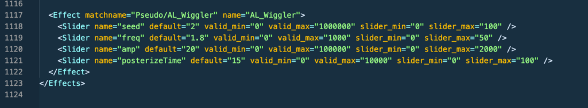
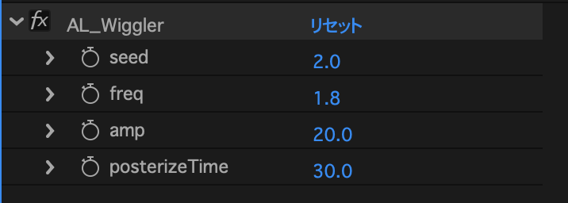

スライダー制御アホみたいに何個もあったらダサいし使いづらい。一つのエフェクトにまとめたい。

ググりまくった結果 pseudo effect とかいうワードにたどり着いた（疑似エフェクトって意味らしい）これでいけそう。

以下流れ

- PresetEffects.xml にお好みのパラメーターの疑似エフェクトを追加する
    - PresetEffects.xml のファイルパスはMacだと「/Applications/Adobe After Effects CC 20XX/Adobe After Effects CC 20XX.app/Contents/Frameworks/aelib.framework/Versions/A/Resources/xml/PresetEffects.xml」
    
    - Windows だと普通に Support Files にあるっぽい
    
    - ※必ずオリジナルのバックアップを取ってから作業を進めること
    
    - パラメーターの書き方は PresetEffects.xml 内の他のエフェクトを参考にすればOK

- スクリプトの addProperty を使って適当なレイヤー（なんでもいい）にさっきの疑似エフェクトを適用

- アニメーション > アニメーションプリセットの保存 でエフェクトを ffx ファイルに保存する

- PresetEffects.xml からさっき追加した部分を削除（本来このファイルはあまりイジらない方がいいっぽいので）

- スクリプトから applyPreset で先ほど保存した ffx ファイルを適用する

これで独自のエフェクトを適用できるようになる。PresetEffects.xml を編集した後は AE 再起動しないと反映されない。

PresetEffects.xml で疑似エフェクト作るときは matchname=”Pseudo/hogehoge” みたいに Pseudo/ って付けたらいいっぽい。

ちなみに AL\_Wiggler の疑似エフェクトはこんな感じで書いた。

なんか ffx をバイナリー化するチュートリアルとか出てきたけど別にそんな工程いらないと思う。あってもいいけど。
