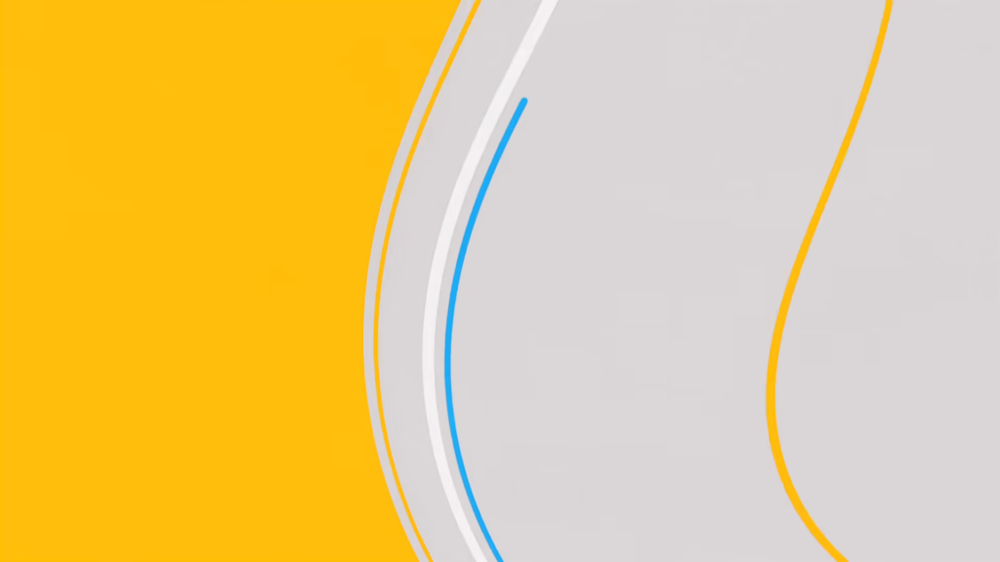

https://youtu.be/PWbRleMGagU

シームレストランジション教の聖典となる激ヤバな動画を解剖してみる。特にサビがヤバい。超ヤバい。何が起こってるのか全然わからない。わかりたい。できるようになりたい。

何をどうしたらシームレストランジションになるのか、どういう移り変わりだと面白く見えるのか解剖していく。

<!--more-->

## 【前提】シームレストランジションとは

ここでは、シンプルに最高速度で場面を切り替えるトランジションはシームレストランジションとは呼ばないことにする。ポイントは要素が連続しているところ。切り替え前のオブジェクトを切り替え後も再利用するイメージ。そのためにはフラットな配色が必須？

## 【0:28～0:35】床から時計へ

床の白から壁掛け時計の白の盤面に遷移する。遠近が矛盾していて面白い。最初何かわからない白を針が横切ることで時計だと理解させる流れも上手い。

よく見ると時計の針が逆向きに回転してる。気づかなかった。次に映るのが「何かを見つめる女性」→「窓際の席で書き物をする男性」だから単純に時間経過を表してる、長い時間彼を見つめていたという説明だと思ってたけどまさかの逆回転。回想してる的な意味合い？

## 【0:45～0:50】窓枠・壁からテーブルへ

窓枠と壁の影の青からテーブルの青へ。遠景の描写から一気に手元の描写に遷移。軽くカメラを回転させて傾きながら移動している。

浮き上がるコーヒーカップ。

## 【1:15～1:42】1番サビ

青色の水平線が黄色に変色しながらぐにゃっと歪んで回転し、回転に合わせて右下から女性が現れる。髪色を背景と同化させている。線状のマップで歪ませることで水面感を出してる。この歪みのせいで複雑に見える。

右下からオレンジのライン。上から万年筆を持った手と紙とコーヒーカップ。

女性が全体の回転に合わせて右の方にフェードアウト。いつの間にか差し込まれる青色。どこから来たんだお前。

右から白の線。下から赤のクソデカコーヒーカップが現れ、大きく形を崩し一瞬だけ背景になって上にフェードアウト。（コーヒーカップだよなこれ。取手みたいなの見えるし）右から男性の横顔。ここも水面の歪みで複雑になってる。

男性の横顔が左に抜けて、下から赤色の水平線。回転しながら歪み、女性が頭の輪郭を背景の歪みと合わせながら入ってくる。

下から白の線。女性だけが回り込むように回転している。右から暗い色の何か。下から薄い灰色と赤の何か。（これもコーヒーカップ？）女性を隠してしまう。

一瞬だけ隠れた際に女性が消える。先程入ってきた赤や暗い色の何かが線状になってフェードアウトしていく。青の線のアクセントも一瞬だけ入って抜ける。破線で書き物を表現。

紙が丸められ転がる。それを拾おうとする手が映り一気に引いて遠景に。歪んだ抽象的な画面から一気に現実的な画面に。

サビここまで。

複雑に見えたサビだが、コマ送りで見てみると要素が入って抜けてを繰り返しているだけに見えた。

## 【2:04～2:09】鍵盤からピアノの床へ

黄色のピアノの鍵盤がバラバラ～っと舞い上がる。鍵盤の黄色が床の黄色に遷移する。右下の方を中心に時計回りで回転して手元にズームインしながら抜けて行く。

## 【2:16～2:40】2番サビ

1番サビと似たような感じなのでパス。（複雑すぎて嫌になってきた）　ピアノの曲線が背景の形と重なって現れるのが上手いと思った。（2:31辺り）

## 【2:45～2:52】線が影へ

黄色の線がぐるっと回転して女性の影になる。

## 【3:21～4:06】ラスサビ

ドラムのキックでパッパッと切り替わる。シームレストランジションを続けてきてからのパキパキした音ハメがとても気持ちいい。紙とか机とか椅子とか、物体が浮いて舞い上がるの普遍的な良さある。

涙が花びらに変わる。ここすき！！！！！！！！！！

モーションタイルの波動を感じる。徐々に暗くしていって真っ黒1フレーム→ピカピカ数フレーム→壁の写真？を見つめる場面1フレーム→赤白1フレームずつ。

## 【おわり】

フェードインは画面外から入れてくる方法と別の要素が移動したときに「最初からそこにいましたよ」みたいな顔して現れる方法の二通りあって、抜けるときも同じように画面外に追いやる方法と別の要素で隠してる間に消す方法の二通りあるように見えた。

何が起こってるのかは大体わかったけど一体どこから思い立って作り始めたらこんな事ができるのか、、、。

あと単純な上下左右の動きがかなり少ない。基本回転してたり斜めだったりする。単調な動きにならない。あと配色が良すぎる。
