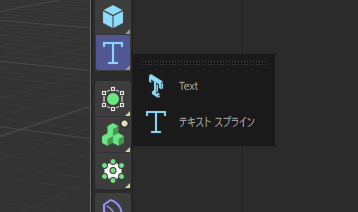
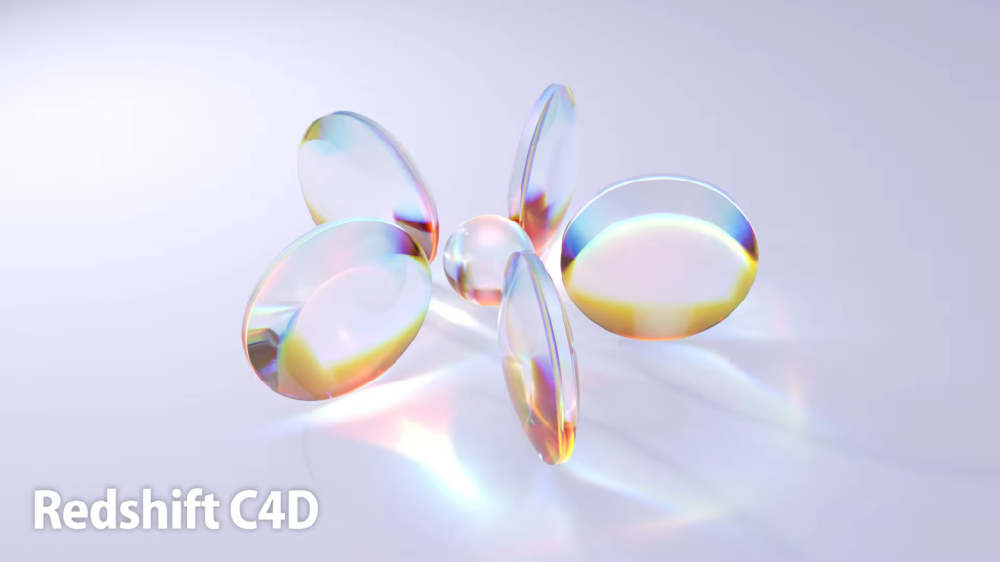
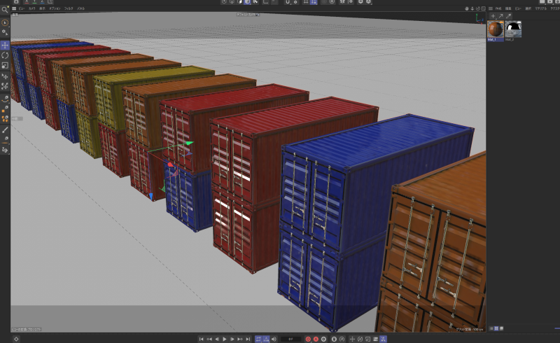
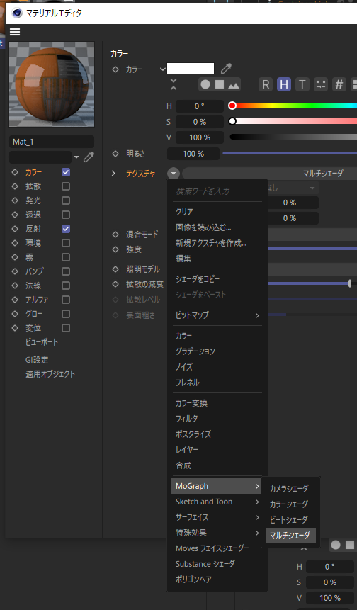
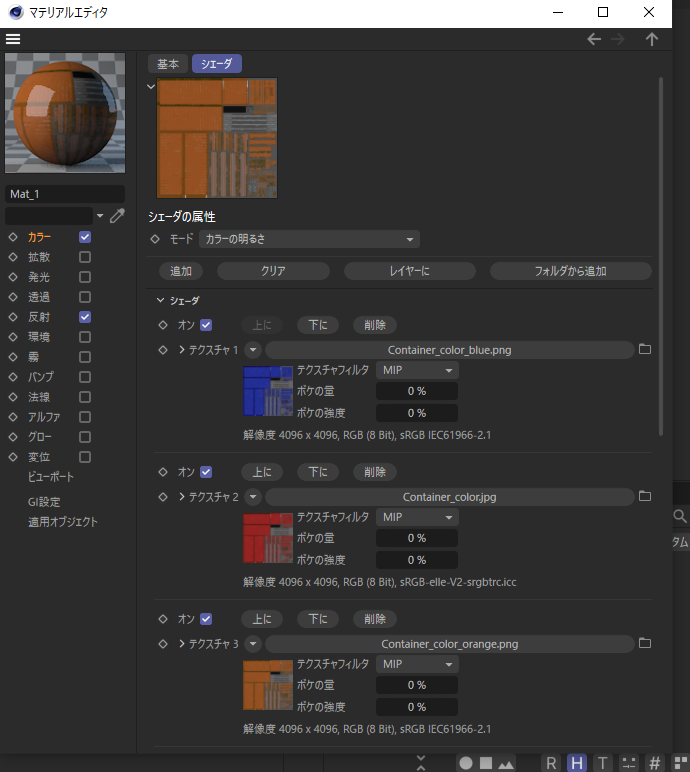
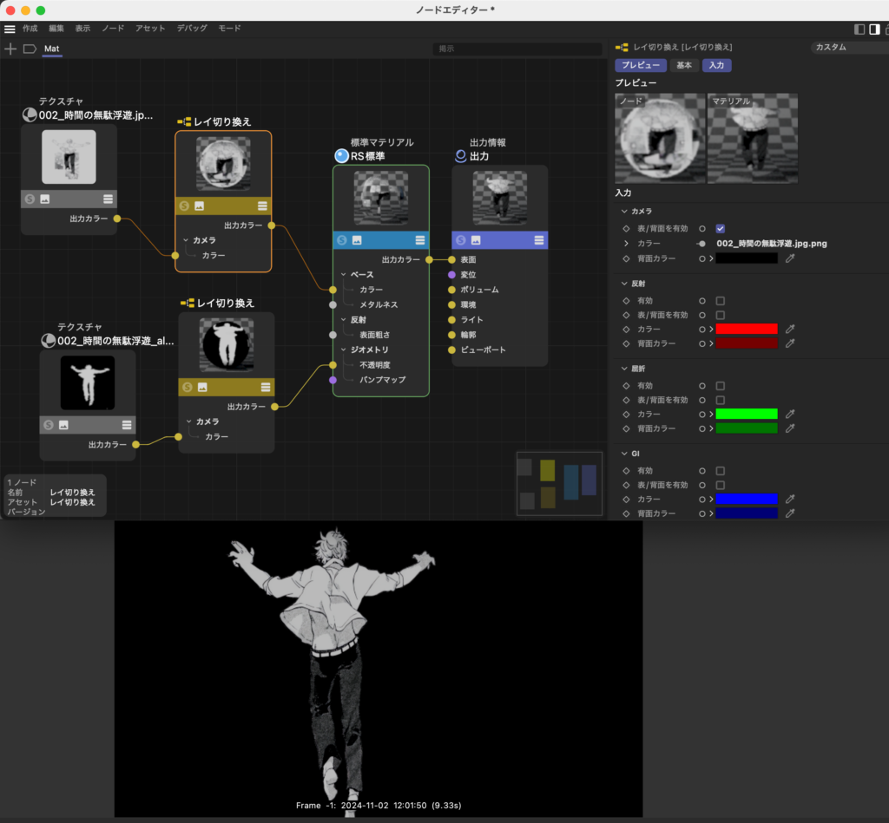
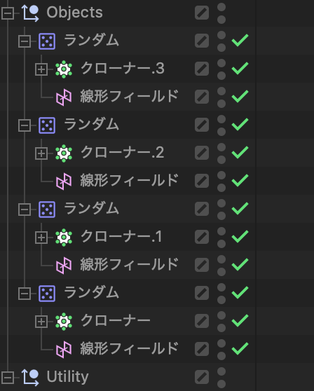

すぐ忘れるので。

<!--more-->

# テキスト追加方法

テキストスプラインのところを長押ししたら出てくる。昔のバージョンではMoTextとかいう名前だったっぽい。

# テキストを縁取りしたい

AEだと塗りをオフにして線をオンにするだけだが、C4Dだとひと手間必要。

テキストを押し出し0にしてオブジェクト化する

エッジモードで選択して右クリックし、「エッジをスプラインに」をクリック

出来たスプラインを使ってスイープ

# パネル上部で右クリック > マネージャーを閉じる でモード切り替えるボタンが消えた

C4D再起動したら復活した。

# Redshift で被写界深度

カメラに カメラタグ > Redshift Camera を追加。

Redshift Camera > Bokeh > Override Enabled を両方有効化。

あとはカメラ本体の焦点距離やらF値やらをいじるだけ。

[📝\[Redshift\] カメラオブジェクトにボケ味(Bokeh)を加えて、写真のようなシーンを作成する方法とは？](https://becgartist.com/redshift-camera-depth-of-field/)

\[2023/04/15\] Redshift Cameraタグが消えた。代わりにカメラを追加したら最初から RS Camera が追加されるようになった。Optical > Bokeh で被写界深度の設定ができる。

# プラグインが認識されない

とりあえずC4Dを最新版にアップデートしたら直った。

# Redshift で Cautsics

<figure>

<figcaption>

こういうの

</figcaption>

</figure>

\- オブジェクトに RS Material を追加

\- マテリアルの Transmission > Weight を1にして透明に

\- オブジェクトに Redshift Objectタグを追加

\- visibility > Casts Caustic Photons にチェック

\- RSライトを追加して Photon > Emit Coutic Photons にチェック

\- Redshift RenderView のバケットレンダリングボタンを押す（クローナーかけたキューブみたいなアイコン）

このままだとノイズが出るので

\- レンダリング設定 > Redshift > Advanced > Caustics > Blur Radius を大きくする

\- RSライト > Caustics > Photons を限界まで上げる（当然レンダリング時間は伸びる）

マテリアルの Transmission > Dispersion の数値を上げると虹色になる。数値が小さいほど色ズレが大きい。

# E3D の Multi Objects 的なアレ

\- オブジェクトの親に「破砕」を追加

\- モードを「セグメントごとに破砕」にする

\- ランダムを破砕に適用

# クローナーで複製したオブジェクトのマテリアルをランダムに

マテリアル > カラー > テクスチャの逆三角をクリックして Mograph > マルチシェーダ をクリック

テクスチャ画像をクリックしてシェーダを表示

「追加」をクリックしてテクスチャを追加

ランダムをクローナーに適用して カラー > カラーモード を「フィールドカラー」に

「アルファ/強度を使う」をオンに

[📝\[Cinema 4D\] 一つのマテリアルで複数の色を適用させる方法とは？](https://becgartist.com/c4d-multi-shader-random/#:~:text=%E3%83%A9%E3%83%B3%E3%83%80%E3%83%A0%E3%82%A8%E3%83%95%E3%82%A7%E3%82%AF%E3%82%BF%E3%82%92%E9%81%B8%E6%8A%9E%E3%81%97,%E3%82%88%E3%81%86%E3%81%AB%E3%81%AA%E3%82%8A%E3%81%BE%E3%81%97%E3%81%9F%E3%80%82)

# キャラ配置

平面を追加してRSマテリアルを適用

TIFFで書き出したキャラの透過画像をノードエディタにドラッグ&ドロップ（アルファ付きとアルファのみの2つ）

アルファ付きを「Color」に、アルファのみを「Opacity」に接続

# ライトの光（light ray）を描写

Redshift Enviromentを追加

マテリアルが真っ黒になるのはライトが弱いから。ライトを強くしてEnviromentのパラメーターを調整。

# ランダム配置

ランダム配置したいオブジェクトをクローナーに

クローナーを選択した状態でランダムを追加

# アニメーション素材読み込み

TIFFで連番で書き出す

RSマテリアルを適用し、ノードエディタに連番の一番最初の画像をドラッグ&ドロップ

「Color」に接続

テクスチャノードの IMAGE > Animation > Mode を「Simple」に

# 物理演算

タグのところからリジッドボディと衝突を探す。（C4DのバージョンによってBulletタグだったりシミュレーションタグだったりする）

落としたいものにリジッドボディタグを、床とか壁とかぶつかる（受け止める？）ものに衝突タグをつける。

衝突判定 > 形状 を「可動メッシュ」にするとちゃんと形通りにシミュレーションされた。

# Redshift でオブジェクトをライト化

RSエリアライトを追加

Object > SHAPE > Area Shape を「Mesh」に

Mesh でライト化したいオブジェクトを選択

Visible をオンにするとオブジェクトが出てくる。複製したい場合はオブジェクトとエリアライトをヌルにぶちこんでからクローナーへ。

# AEでいう「wiggleエクスプレッション」的な

ヌルを追加して位置を0, 0, 0にし、振動タグを追加。このヌルの位置Xの値を利用する。

Xpressoを追加し、ヌルの位置Xからwiggleさせたいプロパティに接続。

# オブジェクトの原点を中心に

ツール > 軸 で色々イジる

# マテリアルの繰り返し

マテリアルタグのサイズU Vをいじる。

ref: 📝[\[Cinema 4D\] 投影法とテクスチャモードを使って、テクスチャをお好みのスケールや位置を調整してみよう](https://becgartist.com/c4d-projection-and-texture-mode/)

# エミッタってどこ

シミュレート > パーティクル > エミッタ

# 紙を舞わせたい

舞わせたいオブジェクトに Bulletタグ > ソフトボディ を追加。ソフトボディ2つあるけどこっちが新しいやつっぽい。

# プロジェクト設定の開き方

Cmd + D

# Redshiftマテリアルで「マテリアルの表のみ」を実現する方法

Ray Switchノード（レイ切り替え）を間に挟む。カメラ > 表/背面 を有効にして背面カラーを黒にすればOK。アルファにも同じノードを挟む必要あり。

ref: 📝[Redshiftrenderでポリゴンの表と裏で違う色を設定したい場合](https://blog.goo.ne.jp/cinema4d_memo/e/c57d80dc84e4f3669ac4e85e9d9f37dd)

# Sketch and Toonレンダリングで背景透過させる

レンダリング設定 > Sketch and Toon > シェーディング > 背景 をオフにする。

# 新しいパーティクルシステム

## パーティクルの粒を特定のオブジェクトにしたい

パーティクルグループにRSオブジェクトタグを付けて パーティクル > モード をカスタムオブジェクトにする。粒にしたいオブジェクトを選択すればOK。

## 開始フレームをマイナスにしても最初から降ってくれない

プロジェクトのスタートもマイナスにして、0からレンダリングすればOK。

ref: 📝[I Need My Emitter to start emitting before frame zero.](https://creativecow.net/forums/thread/i-need-my-emitter-to-start-emitting-before-frame-z/)

# ヌルの中にオブジェクトを複数入れて、そのヌルをクローナーで複製してからランダムエフェクトを適用したときに、ヌルごとにランダム化するのではなく、ヌルの中のオブジェクトごとにランダム化させる方法

長い。結論：無かった。

なので、4つのオブジェクトがヌルに入ってたなら、一個一個のオブジェクトにクローナーをかけて、4個のクローナーを用意する。んでそのクローナーにそれぞれランダムエフェクトを追加する。は？？？？？？

追記：Twitter(X)で聞いたらやりたCCさんが教えてくれた。天才じゃん……。

📝[https://x.com/yarita\_cc/status/1854553958586757553](https://x.com/yarita_cc/status/1854553958586757553)

# 一撃でオブジェクトを非表示に

上のチョボ丸を Opt + Shift クリック。

# ランダムのXYZの値を同時に変える

P をクリックすれば PX PY PZ が選択されるから、選択された状態で Cmd ドラッグ。数値を入れる場合は数字を入力してから Cmd + エンター。
