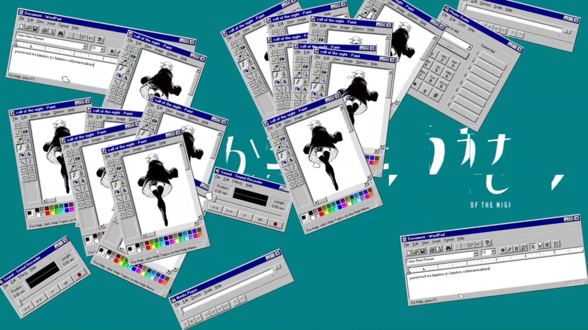
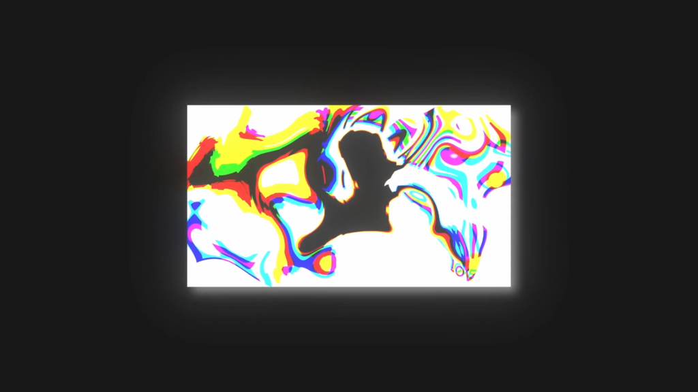
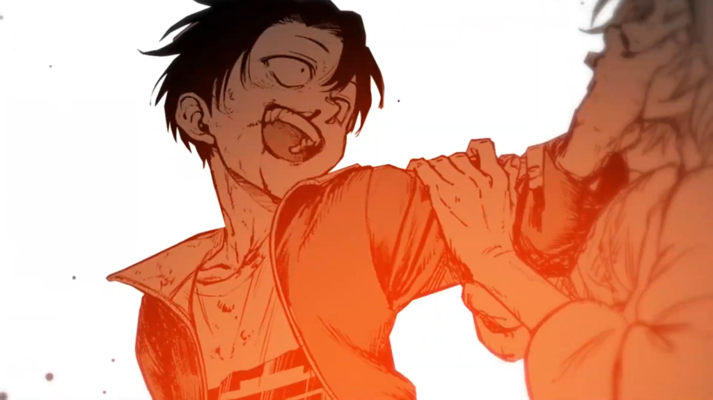
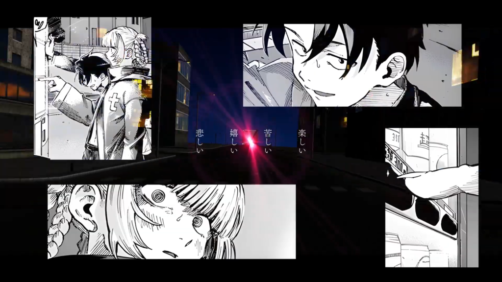

はじめは化物語でやろうと思ってたんですよね。

ゆるい感じで今回の制作の流れを振り返ってみようと思います。

<!--more-->

## 【9番目の「？」の意味】

今回は曲を先に決めて後からソースを合わせていく形の制作になりました。この曲は自分のとっておきです。音ハメできるポイントが多く、曲調の変化も激しいので作ってて絶対楽しいだろうなと思ってました。（実際楽しかったです）曲が先だと色々自由で楽しいですよね。

アルファベットをAから順に数えていくと9番目は「I」＝「アイ」＝「愛」で、要するに恋愛の歌なんだな～みたいな解釈。

歌詞を見てみるとめんどくさい女がイメージできたので戦場ヶ原ひたぎと阿良々木暦の関係性が当てはまる気がしましたが上手くいかず、ちょうどその頃よふかしのうたのアニメが始まって「そういえばナズナもわりとイメージに合う気がする」と思い制作を開始しました。

## 【今回目指したもの】

今回、自分の中での目標が「MADではあまり見ない映像表現をなるべく取り入れる」でした。

Nanatsukiさんが現れてからNanatsukiさんっぽいMADが増えすぎたと思いませんか？いや、わかりますよ。あんなの見たら「俺もやりて～～～！！」ってなりますよね。あまりにも魅力的。彼のMADはどれも人をやる気にさせる力がある。

でもどれだけ色調や文字組みを真似ても、構成力で裏打ちされたオリジナルには絶対勝てないと思うんです。Nanatsuki道は修羅の道。誰もが彼を目指すが誰も彼にはなれない。

だからNanatsukiさんとは違う方向で頑張ろうと思いました。（今回に限らず毎回気をつけていることではありますが）ちょっとでも気を抜くとNanatsukiさんになりたくなってしまうので、それをぐっと堪えて逆へ逆へ。その逆張りの産物が今回のMADです。

## 【0:00～ イントロ】

最初に埋まったのはイントロでした。

まずはドラムがダカダカ言ってるところから。うるさいから映像も勢いが欲しい、なんか目まぐるしく画面が動いてほしい、みたいなこと考えながらPinterestを眺めているとこんな画像が

<figure>

<figcaption>

正確にはPinterestで見つけた画像の類似検索で発見。元の画像は忘れた

</figcaption>

</figure>

はい、まんまですね。丸パクリです。車のショーか何かですかね。（映像作品じゃなさそうだからセーフ！）

これを見ながらC4Dで作りました。

<figure>

<figcaption>

クローナーにランダムつけてシードにキーフレーム打ってガチャガチャ

</figcaption>

</figure>

* * *

次のキャラ紹介風なカットはBLEACHやヒロアカのPVを参考にしました。本家のグラフィックには到底及びません。

<figure>

<figcaption>

このAが斜めになってるフォント何ていうんだろう…。有識者いたら教えてください。　解決しました。感謝

</figcaption>

</figure>

* * *

ここはTotoriさんのMADMAX 2020の作品[【MAD】起点【阿良々木暦】](https://nico.ms/sm38033798)の冒頭のオマージュ。本当は「ようこそ夜の世界へ」にしたかったんですが、そこまで真似てしまうとパクリと言われそうなので「遊ぼうぜ少年」に。

<figure>

<figcaption>

ここもC4D

</figcaption>

</figure>

* * *

次のぐにゃぐにゃしてるところは [蒼山幸子「PANORAMA」Music Video](https://youtu.be/6UnV22UpnBE) がリファレンス。大麦さんが絶賛してたやつ。質感に天と地の差が……orz

* * *

ガラスが舞ってる空間をクルクル回り込むところは特にリファレンスなし。

<figure>

<figcaption>

イントロ作ってた頃は探偵さんがいっぱい出てくるハロウィン編をラスサビ辺りのメインにしようと思ってた

</figcaption>

</figure>

## 【0:20～ Aメロ】

ここも特にリファレンスなし。音に合わせてガシャっと崩れるのは [三月のパンタシア 『101』](https://youtu.be/vryLhrwJAfA?t=101) で見て面白いと思った表現。

<figure>

<figcaption>

windows 95 可愛い～～～～！！

</figcaption>

</figure>

<figure>

<figcaption>

windows の UI とか本来崩れないものが崩れたりすると面白いと思う

</figcaption>

</figure>

<figure>

<figcaption>

ここの足の動き、めちゃくちゃ時間かかった

</figcaption>

</figure>

* * *

ここはPinterestで見つけたこの画像から着想を得ました。わりと変な絵面ができて良かったと思います。

* * *

<figure>

<figcaption>

作品を展示してる風なやつ

</figcaption>

</figure>

<figure>

<figcaption>

本来崩れないものが崩れたりすると面白いと（ry

</figcaption>

</figure>

## 【0:50～ サビ】

一番の見せ場となった落下シーン。サビは勢いが欲しい、勢いを出すには落下シーンしかなかろうといった感じで1巻の落とされるシーンに決定。正直勢いを出せれば何でも良かった。

Mizumiさんの [【静止画MAD】よふかしのうた【シカバネーゼ 】](https://youtu.be/FV4QQ7n23hU) を参考に光を入れたりしました。

<figure>

<figcaption>

珍しくちゃんと髪揺れさせてる。えらい。

</figcaption>

</figure>

<figure>

<figcaption>

ALINCO MAD頻出オブジェクト、鉄骨

</figcaption>

</figure>

## 【1:02～ 間奏】

間奏は楽器隊が暴れるので音をバチバチに拾えばそれっぽくなるだろうと思って割と自由に埋めていきました。思いついた絵をパッパッっと作っていった感じです。

ここもPinterestで見つけた画像から。動物のところをそのままキャラに変えたら成り立たないだろうかと。

<figure>

<figcaption>

珍しくキャラモーション頑張った

</figcaption>

</figure>

* * *

テレビのカラーバーで音ハメしてみたら面白いかな～と思って。

* * *

オレンジの背景は Contour という自作スクリプトによるもの（自作と言ってもAviUtlのスクリプトを再現しただけですが）

<figure>

<figcaption>

シェイクスピアの『マクベス』に出てくる一節「明けない夜はない」

</figcaption>

</figure>

* * *

<figure>

<figcaption>

輪切りコウくん

</figcaption>

</figure>

<figure>

<figcaption>

ガンギマリコウくん

</figcaption>

</figure>

## 【1:14～ よくわからないパート】

ここの歌詞がこの曲の肝なので歌詞を聞かせるようにしてみました。そのまま歌詞をテキストで表示したり123、ABCをオブジェクトとしてそのまま取り入れてみたり。ここも割と自由に埋めていきました。

<figure>

<figcaption>

E3D の Custom Texture にアニメPVの映像を使って Deform でグシャグシャにしてみた。もう少し元の絵が分かる感じにぶっ壊すことができればもっと面白かったかもしれない。

</figcaption>

</figure>

<figure>

<figcaption>

コラージュ的な映像は絶対やろうと思ってたけど、意外と難しかった。質感が足りない。

</figcaption>

</figure>

<figure>

<figcaption>

C4Dの物理演算で作成

</figcaption>

</figure>

## 【1:37～ ラスサビ】

ラスサビが一番苦労しました。なんせ何も思いつかなかったので……。

いきなりハロウィン編に飛んで戦闘シーンとかも考えましたが、この曲は男女の関係性の歌なのでナズナとコウの話だけで締めるべきでは？となり、5巻46話のコマを当てることにしました。ここらへんの話はアニトクさんの [【静止画MAD】吸血鬼の夜【よふかしのうた】](https://youtu.be/ZMspUD_mYDk) で丁寧に拾われてるので見てない人は見ましょう。

ところがどっこい、この話には落下シーンもなければ戦闘シーンもない！勢いが出せない！！

悩んだ結果「本編に全然関係ないイメージ映像だけで勢いを出そう」という結論に。ビルの間をものすごいスピードで進んでいく背景映像にはなんの意味もありません。

<figure>

<figcaption>

みんな大好きメトロポリタン

</figcaption>

</figure>

これだけじゃダメかと思いモーショングラフィックスさせたり台詞を入れたりして間を持たせました。

<figure>

<figcaption>

苦手なモーショングラフィックス、頑張った

</figcaption>

</figure>

## 【振り返り】

今回の制作は自由な感じで楽しかったんですが、それ故に苦労もしました。自分は面白い絵がポンポン思い浮かぶような天才ではなく、頑張って奇をてらう凡人なので、常にアイデア不足なのです。

そんなアイデア不足を解消してくれたのはTwitterとPinterestでした。いつも刺激をくれるようなものをいいねRTしてくれる人が何人かいて非常に助かってます。Pinterestは系統の似たリファレンスを大量に集めることができるので便利です。一時期明日ちゃんしか流れてこなくなりましたが

<figure>

<figcaption>

ちょっとでも良いなと思ったものはDLしてフォルダ分けするようにしてます。

</figcaption>

</figure>

今回の目標の「MADではあまり見ない映像表現をなるべく取り入れる」はある程度達成できた気がします。曲的にもっともっとおかしなことが出来た気もしますが。

『反省点・今後の課題』

- もっと1カットごとに質感を出せるようになりたい。
- もっと人と違うことがしたい。
- 画像からアイデアを得てそれを動画にする際の動きのバリエーションが少ない。
- 全体の統一感がない。行き当たりばったりで作れたのは曲のカオス感のおかげ。これが許されるのは今回だけ。

自分の弱みである構成力のなさは今回全く克服できませんでした。（克服する気もありませんでしたが）頭を使わなくていいタイプの作り方にしたので逃げですね。初見にもストーリーを理解させてかつ感動ポイントも抑えるってめちゃくちゃ頭良くないと難しくないですか？俺バカだから無理

それと、原作が先で曲が後に決まるタイプの制作でも今回のように自由に作れる方法を確立したいです。楽しく作るのが一番なので。
