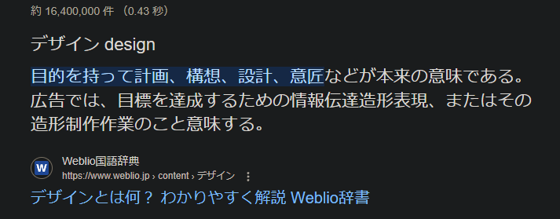

## 言いたいこと

デザインという言葉に違和感を覚える。

## デザインってなんなの

デザインは伝えたい情報をうまく伝えるのが本来の役割。「この情報をこんな人に向けて発信する」みたいな目的を持って作られるもの。

だから、映像制作者のやる、ただ単に気持ちよさとかぱっと見のルックの良さとかを上げるためのアレはデザインとは呼ばない気がする。

例えばこれ。どうやってこれが生み出されたのか全くわからん。

本来デザイナーがデザインを作るときって、伝えたい情報が先にあって（例えば画像とかテキストとか）それを効果的に見せるためにフォントやレイアウト、配色を考えたりすると思う。でも、このデザインを作るときに最初にあったデータって多分ミクの立ち絵と歌詞と音源だけだと思う。何かしらの指示はあったかもしれないけど。

伝えたい情報は特にないのに、まるであったかのように整頓されたデザインを作れるのが本当によくわからない。

## 手段と目的が逆転してる

本来デザインは手段だけど映像制作者はデザインが目的。そこがまずおかしい。
