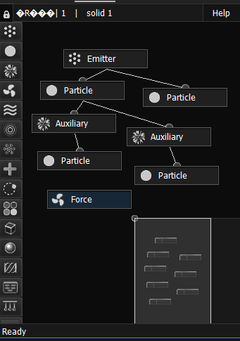
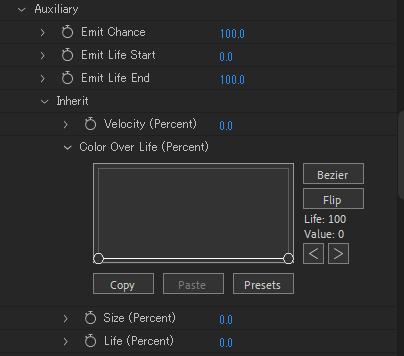
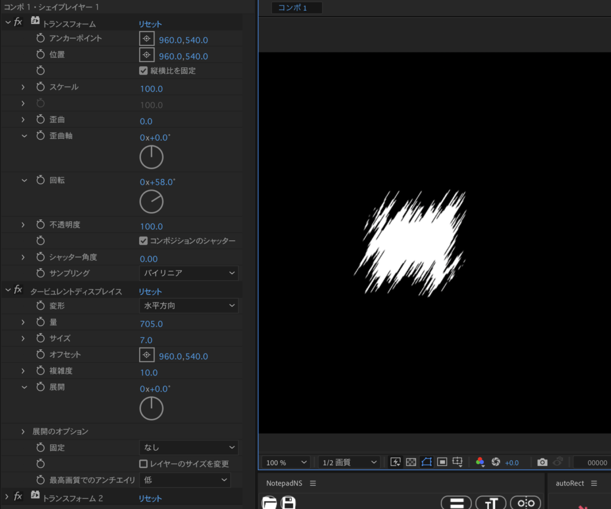
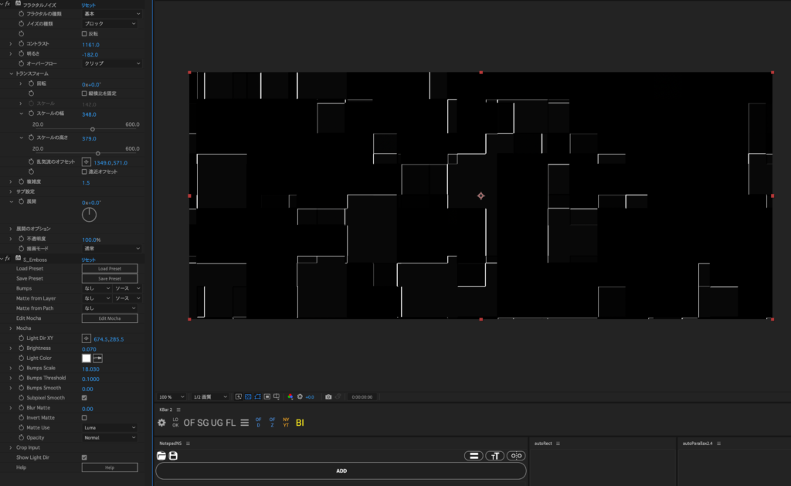

多分ほとんど書くことないけど一応

<!--more-->

# フラクタルノイズ32bitで合成するとぶっ壊れる問題

オーバーフローをクリップに変えればOK

# シェイプの線幅を増やすとき内側にだけ大きくなるように

パスのオフセットを追加

オフセットの量を線幅に紐づけて -2 で割る

ref: [📝Aftereffectsのシェイプレイヤーのストロークをパスの外側・内側に設定する](https://note.com/nohama123/n/n7d040420dfee)

# モーダルダイアログが云々のエラーが出るまでスクリプトが動作しなくなるやつ

適当にCEPスクリプトのボタンをクリックすれば解除される。

# KBar に直接書くスクリプトでは return が使えない

らしいですよ。

# Stardust

## Force はどこにも繋がなければ全体に作用する

はぇ～。

## Aux は Emitter と似てる（というかほぼ同じ）

ParticleにAuxを繋ぐと、パーティクルの粒から新しくパーティクルが出てくるようになる。Auxの下にはEmitterと同じく、Particleノードが必須。

<figure>

<figcaption>

花火作ったときのノード

</figcaption>

</figure>

## Aux のパーティクルを別の色にする方法

Aux > Auxiliary > Inherit > Color Over Life のグラフを一番下まで下げる。下一直線みたいに。カーブさせるとその通りに色が変化する。

# 円形グラデーション

レイヤースタイルを使う。

# Stardustで被写界深度がかからない

AE再起動すればかかる。

# 斜めタービュレントディスプレイス

タービュレントを挟む形でトランスフォームエフェクトを適用して、回転が逆になるようにエクスプレッションを組めば自由に角度を変えられるようになる。なお端が見切れる。

# ブラーの値がゼロになるときにパキるやつ対策

不透明度もゼロにしてやるとわりと緩和できる。

# フラクタルノイズにS\_Embossというアイデア

このツイートを見て考えた。

https://twitter.com/aescripts/status/1788569933435072995

# コンポ内の特定のプロパティを上の階層のコンポから変更する

エッセンシャルプロパティを使う。プロパティを選択して右クリック > エッセンシャルグラフィックスに追加。エッセンシャルグラフィックスパネルでそのプロパティのコンポを選択している必要がある。

これを繰り返していけば2階層下のプロパティとかでも上から変更できる。これで同じコンポを都合よく使い回すことが出来る。

# 無限エラー「マトリックスを分解できません。（17、45）」

OK押しても無限に出てくるからプロジェクトを開くことも閉じることも出来なくなる。

別のプロジェクトにその問題のAEPをインポートすれば開けるようになる。多分原因となるコンポが存在するので、そいつを消したら解決。

ref: 📝[ERROR (17 ::45) unable to decompose matrix](https://community.adobe.com/t5/after-effects-discussions/error-17-45-unable-to-decompose-matrix/m-p/9383288)

# 加算でオーバーフロー起こして上のレイヤーにも影響を及ぼす問題

「合成アリスマチック」のオーバーフロー動作 > クリップでいける。

Sapphireのグローお行儀悪い問題もこれで解決する。

# なんかプレビューすら一切映らなくなったんですが…………

S\_DistortChromaのレイヤーを探してオフにしましょう。大体こいつが悪い。追記：Sapphire 2025で直った気がする。

# Tabキーのショートカットを変えたい

（Windows）\\Users<ユーザー名>\\AppData\\Roaming\\Adobe\\After Effects<バージョン>\\aeks  
（Mac OS）/Users/<ユーザー名>/Library/Preferences/Adobe/After Effects/<バージョン>/aeks

にあるショートカットのテキストファイルを直に編集すればいける。ちなみに自分はAL\_OneClickPrecompにしてます。

[OneClickPrecomp - cano](https://booth.pm/ja/items/6454696)
