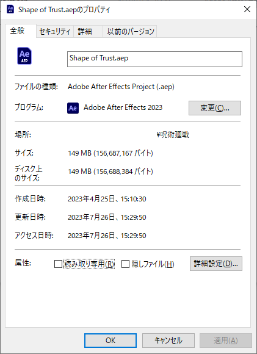
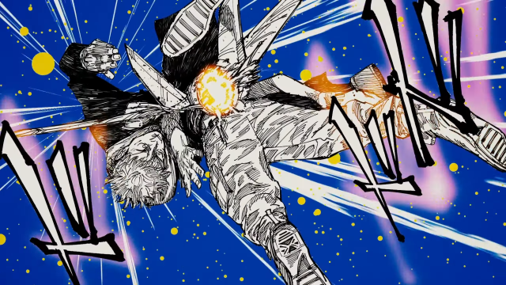
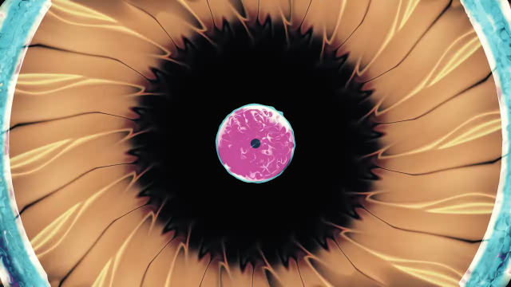
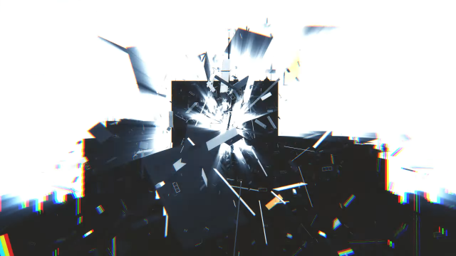
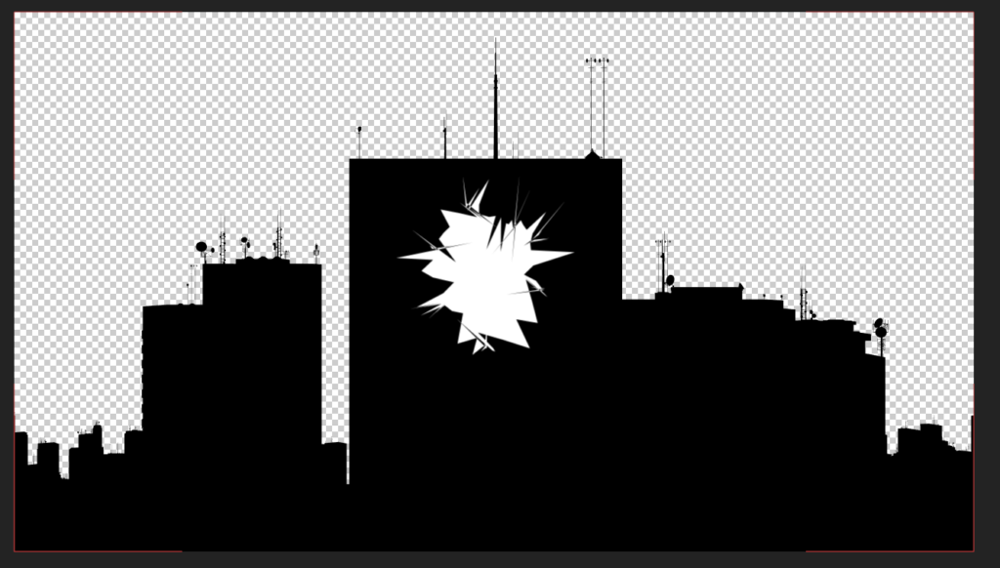
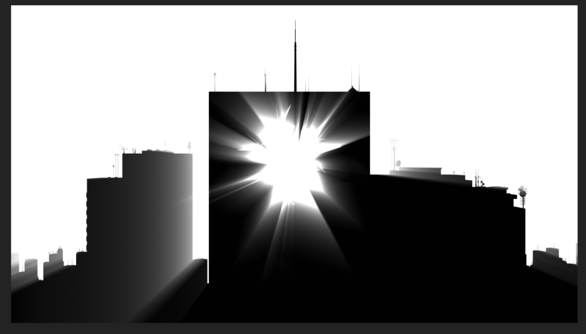
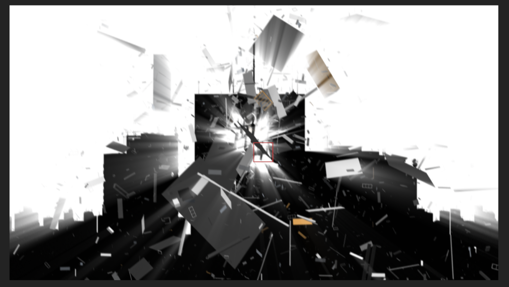
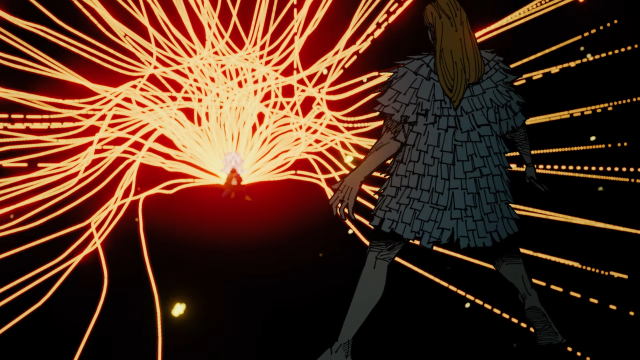
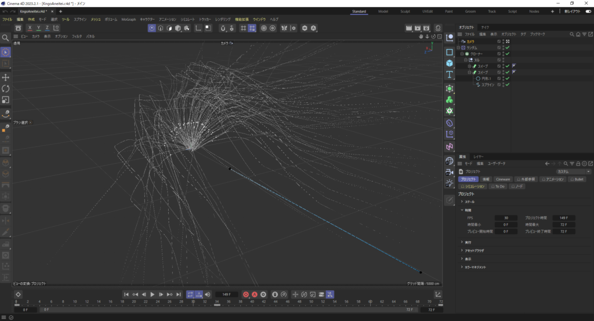
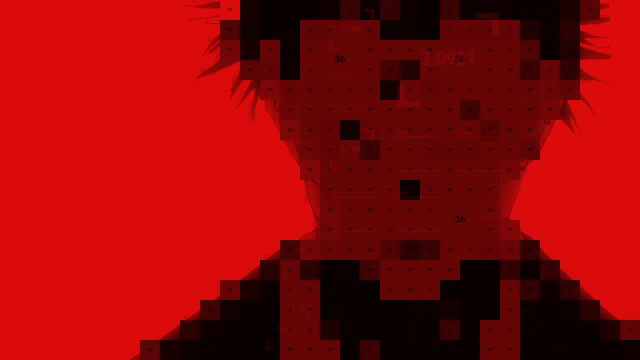

過去一時間がかかったMADだったのでちょっと振り返り的なアレを。

<!--more-->

# 制作期間

<figure>

<figcaption>

149MBのAEPってなんだよ

</figcaption>

</figure>

この画像だけ見たら制作期間3ヶ月に見えますが、この前にAEPが壊れて吹っ飛んだデータがあるので、それも含めれば1年以上かかったと言えるかもしれません。

吹っ飛んだのはワンオクのDeeper Deeperを使ったもの。進捗をTwitterに上げてたから見たことある人もいるかも。

<figure>

https://twitter.com/ALINCO2020/status/1610963536494354433?s=20

<figcaption>

この時点でリメイク。ちなみにこのあともう一回AEP死にます。旧PCに4Kは厳しかった。。。

</figcaption>

</figure>

<figure>

<figcaption>

このカットはそのDeeper Deeperのときに作ったやつ

</figcaption>

</figure>

あと進捗は出してなかったけど、仙台コロニーの戦闘だけで1つのMADを作ろうとしてました。曲は「[ストラトキャスター・シーサイド '22](https://youtu.be/-wObP7x-gCo)」。乙骨君が大暴れするだけでは尺が埋まらなかったので断念。

あ、やっぱ進捗だしてたかも。バキバキイーズのやつです。

https://twitter.com/ALINCO2020/status/1580923322765672449?s=20

# 技術的なあれこれ

## 五条先生の目の中に入っていくところ

シェイプの動きがベースにあって、それをRGBDelayさせたりCC Vector Blurかけたりしてます。あと仕上げにMojo Ⅱ二枚がけ。

CC Vector Blur、簡単に情報量が増えて今後重宝するかも。

## ビル破壊シーン

200％茈食らってビルが崩壊するシーンをどう表現しようか悩んだ結果できたのがこれ。

黒で塗りつぶしたビルに白のシェイプを乗せて

白背景にして逆行のエフェクトを足して（Crate's Godraysというエフェクトを使用。軽くてオススメ）

最後に飛び散る破片を足してます。茈がビルを貫通したみたいな表現をしたつもりですが、上手く行ったか正直微妙です。

## 伏黒の領域展開

光の筋が伸びていく表現はC4Dで作りました。C4DとAEの連携、初めてだったけど上手く行ってよかった。もうすでにどうやったか思い出せない。

あとは特に書いておきたいことないかな……。あ、そういやYanobox Mosaic買ったんだけど気づいた人いるかな……。高かった割にあまり効果的に使えなかったかも。

<figure>

<figcaption>

Yanobox宿儺

</figcaption>

</figure>

# 終わり

感想：疲れた。。。。。。。

振り返ると「一体何にそんな時間かかったんだよ」って感じですね。とりあえず完成できてよかったです。

入れれなかったキャラクターや戦闘いっぱいありますね。。。高羽とか2フレームしか出てこねえ。。。

でも多分Ninja氏がもっと密度の濃い死滅回遊MADを上げてくれると思うので、それを楽しみに待ちたいと思います。ご視聴ありがとうございました。

**AniPAFE作るぞ～～～～～～～～～～～～～～！！！！！！！！！！！！！！！！！！！！！**
