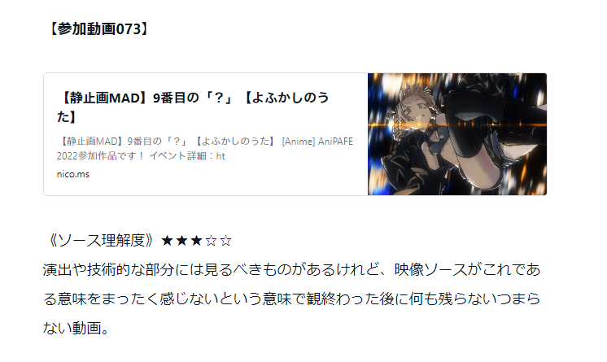
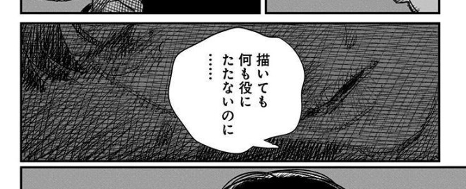
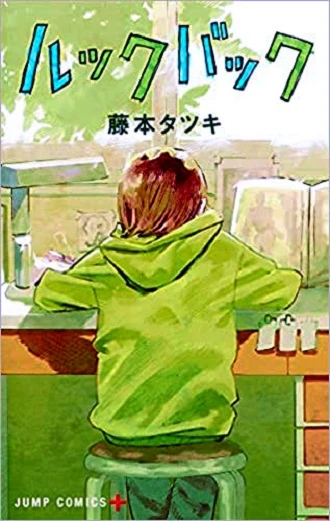
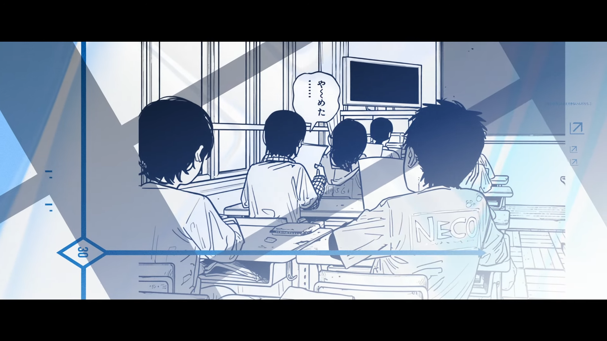
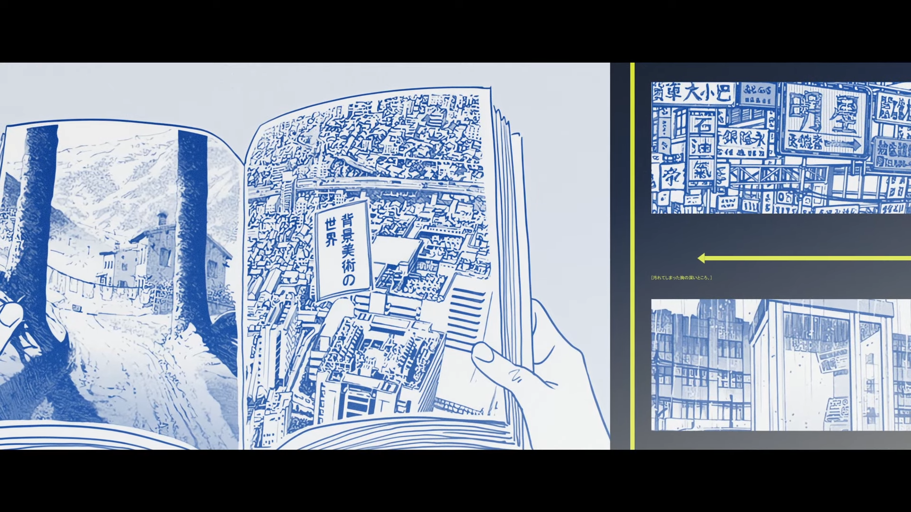
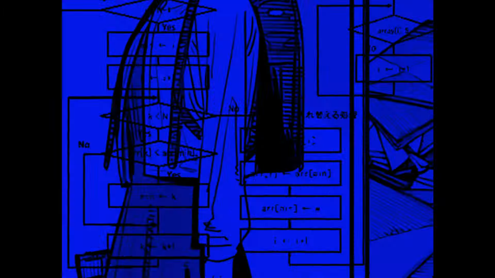
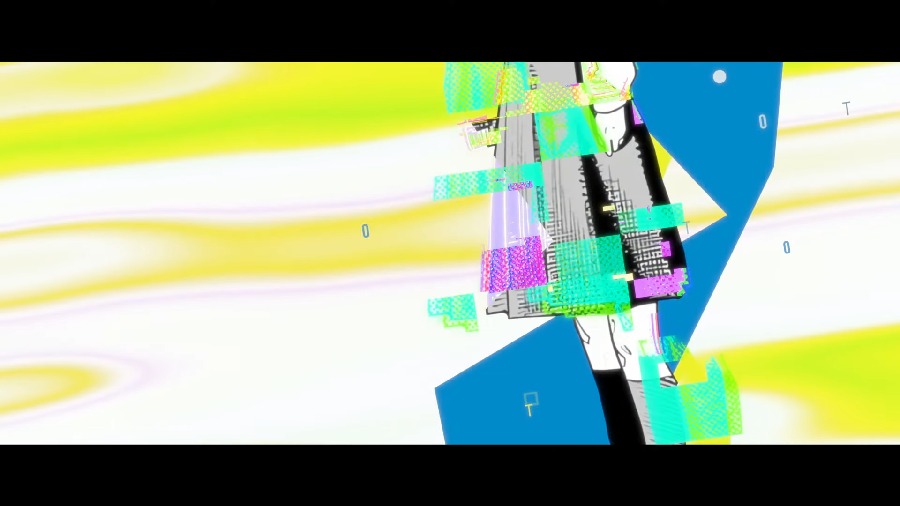
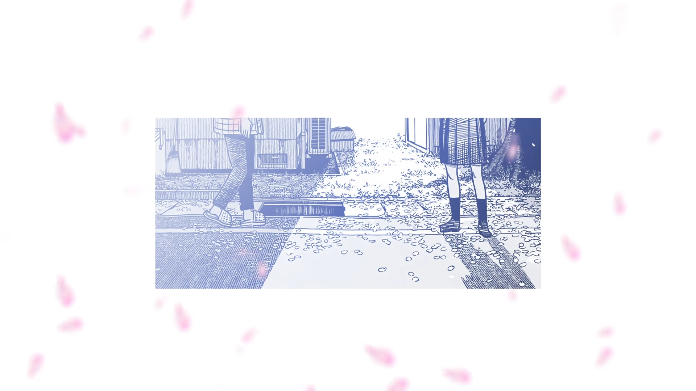

AniPAFE2023はルックバックのMADで参加しました。ちょっと後語りをさせてください。

<!--more-->

# 今回の目標

[AniPAFE2022作品感想(03/05)｜Chack'n](https://note.com/chackn/n/ne4a2b3c14b3f)

- 去年言われた「このソースである意味を感じない」という指摘を受け止め、改善する
- テーマ賞に参戦、受賞

この2つが主な目標でした。あの感想、結構刺さってたんですよね…。胸が痛え。今回のも演出面で同じこと言われたら何も言い返せないかも。「この演出である意味を感じない」みたいな。でも組み合わせは上々だったので、クリアできたことにします！

問題は2つ目です。

ぶっちゃけテーマ賞投票してくれた方いますか？多分ほとんどいないですよね……。いや、どうだろう……。もし入れてくれてたらありがとうございます。

今回のテーマは「過去の選択を悔やむ事なかれ」だったんですが、長い上にピンとこない……。「三つ編み」みたいに短くスパッと言い切れる言葉を探したんですが、全然見つかりませんでした。

しかもこれってルックバックのテーマであってこのMADのテーマではないですよね……。てかソースのテーマとMADのテーマが乖離してて良いのか？そもそもソースに沿わせたMADでテーマ賞に参加するのが間違いだったのか？編集者であるMAD作者がオリジナルのテーマを決めて、それに沿った作品を作って参加すべき部門だったのでは？わからん……ﾅﾆﾓﾜｶﾗﾝ。

あんまり納得が行ってないのでまたいつかテーマ賞、挑戦できたら、いいな、、、、ぐらいの気持ちでいます。

で、ルックバックとfalse colorで行こうと決めたは良いものの

# 演出がなんも思いつかねえ……

マジで1mmも画面が浮かんでこない。今までいかに自分が何も考えずに画面を埋めてきたか思い知らされました。

なぜ適切な演出が思い浮かばないのか考えた結果、ソースの理解不足が原因ではないかという結論に。ということでソースの深掘りから始めました。そもそもルックバックはどういう話だったのか。ルックバックの主題とは。

## ルックバックって結局どういう話？　〜ルックバック、再考。〜

ルックバックは前半と後半で実質2部構成になっていてまた話が変わってくるんですが、メインの後半の方を強引にまとめると「分岐した別の世界の可能性に導かれて背中を押される話」だと言えます。

ルックバックってあの扉の下の隙間だけがフィクションなんですよね。あの隙間を4コマ漫画が行き来し、現実世界とパラレルワールド（別の可能性）を繋ぐゲートの役割を果たします。そのパラレルワールドでは、藤野は空手をしていて、そのおかげで京本を救うことができます。命拾いした京本は4コマ漫画を描き、それが風に飛ばされてまた扉の下を通過し、扉の前で座り込んでいる藤野を扉の先へ導きます。藤野はそこで見つけた自分のサインを見て京本との日々を振り返り、再び漫画を描く決意をしたところで物語は終わります。

上記のように解釈すると「要らないと切り捨てた過去も要らないと傷つけたこの心も明日に繋がっていると知った」というfalse colorの肝である歌詞に上手く合わせられるかな～と思いました。いける、いけるぞこれ！

（いやでも繋がってる理由が「扉の下が偶然別世界と繋がっちゃいました～てへっ☆」だとあまり情緒的じゃない気が。。。たしかに繋がってたけれども。。。ええい、ごちゃごちゃうるさい！！）

でもまだ画面が思いつかない。。。もう少し考えます。

## 藤野の間違いとは　～ルックバックのテーマ～

とある物語の作り方のサイトによると、良いストーリーとは「間違いが正される話」だそうです。

> 物語とは結局のところ間違いが正される話のことです。
> 
> 主人公が何も間違っておらず、ただ頑張るだけで敵に勝ってしまってはダメ。こういうストーリーのことを主人公がただ頑張るだけの話と呼びます。絵に書いたような駄作になります。
> 
> 戦いの中で主人公が間違いに気づく。これがドラマのみなもとです。

[https://monosai.com/main/2-omosiroi-story](https://monosai.com/main/2-omosiroi-story)

ルックバックは戦いの話ではありませんが、「間違いが正される」の部分は当てはまると思います。藤野が自身の間違いを正す、そんなストーリーラインがある。藤野の間違いと言えばここですよね。

藤野の間違いは「過去の否定」です。これは誰にでも当てはまる普遍的なテーマの一つだと思います。誰だって悔やんでも悔やみきれない過去の選択や行動があるはず。

じゃあルックバックのテーマは「過去の肯定」になるのかと言われると、ちょっと違う気がします。実際京本死んでるし、描かなければ死ななかった。否定も肯定もできないから「Don’t look back in anger（振り返るな）」になるのかと。

 

なんか上手く文章に起こせないので、MADの話に行きます。すみません。

# 青と黄色の色分け

青＝藤野、黄色＝京本のイメージで色分けしましたが、普通に装飾としても使ってます。なぜ青と黄色にしたかと言うと、表紙のカラーが黄緑でルックバック＝黄緑の印象があったからです。

京本の黄色がちょっと緑がかってるのもそのせい。混ぜたら丁度表紙に近い色になるんじゃないですかね。

# Aメロの矢印 is 何

**俺もわかんねえよ！！！！！！！！**

パラレルワールド、別の可能性、分岐、if、プログラミング、フローチャート、みたいに連想して矢印で物語の流れを表現しよう！的な着想だった気がします。でも全然上手く行ってないです。あんまり絵的にも面白さがない。

\[caption id="attachment\_2398" align="alignnone" width="1920"\] 藤野の挫折を表現したり（なんか分岐してますが本来の分岐点はここじゃねえ……）\[/caption\]

 

\[caption id="attachment\_2399" align="alignnone" width="1920"\] 藤野が漫画を描かなくても結局京本は美大に進んでしまう様子を表現したり\[/caption\]

 

\[caption id="attachment\_2436" align="alignnone" width="1920"\] ちなみに冒頭のグジャグジャしてる部分にもフローチャートは入れてました\[/caption\]

 

# 終盤のガチャガチャしてるやつ、何？

あり得たかもしれない可能性が混在しているシュレディンガーの藤野です。京本が部屋から出てくることでメインルート（京本死亡ルート）に確定します。でもそれは悲しいことではありません。ここから二人の関係が始まるので。

\[caption id="attachment\_2401" align="alignnone" width="1920"\] 終わりが始まりな構成好き。\[/caption\]

 

# 感想

**苦しかった。。。**

色々考えたわりにその苦労が画面に反映されませんでした。苦しすぎる。もしこれが良い順位を取ったら、これから先ずっと苦しみ続けなければならない気がします。クソ怖え〜〜〜。でも良い順位取りてえ～～～～。

去年のよふかしと比べるとインパクトは弱いかもですが、MADとしては良くなったんじゃないかと思います。「MADはソースに寄り添うべし」みたいなことをほざく脳内のMAD原理主義者がそう言っています。

果たしてどんな結果で終わるやら。。。結果発表が楽しみです。
