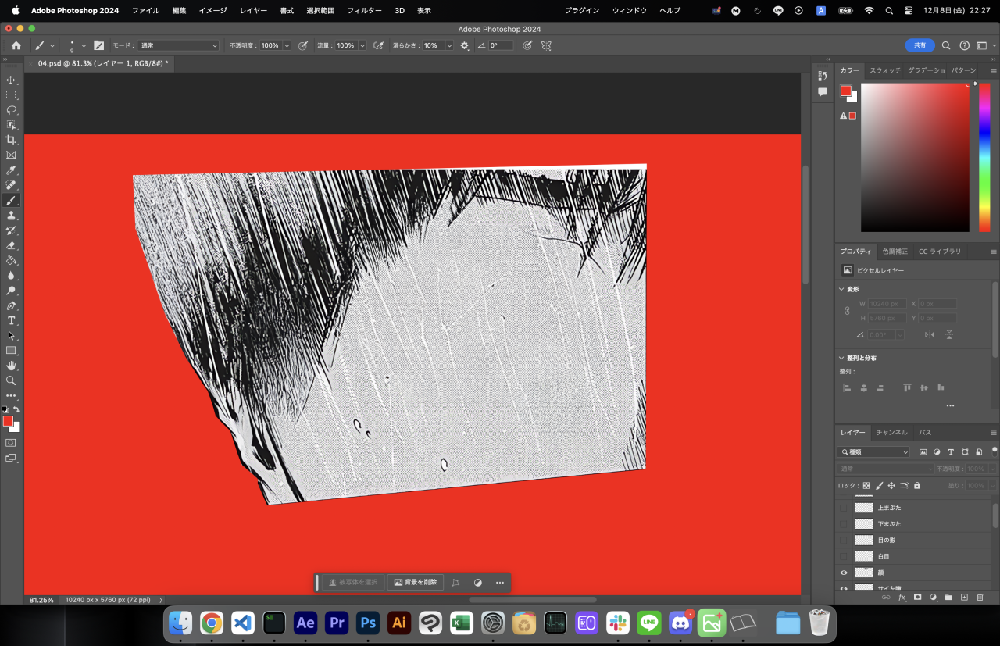
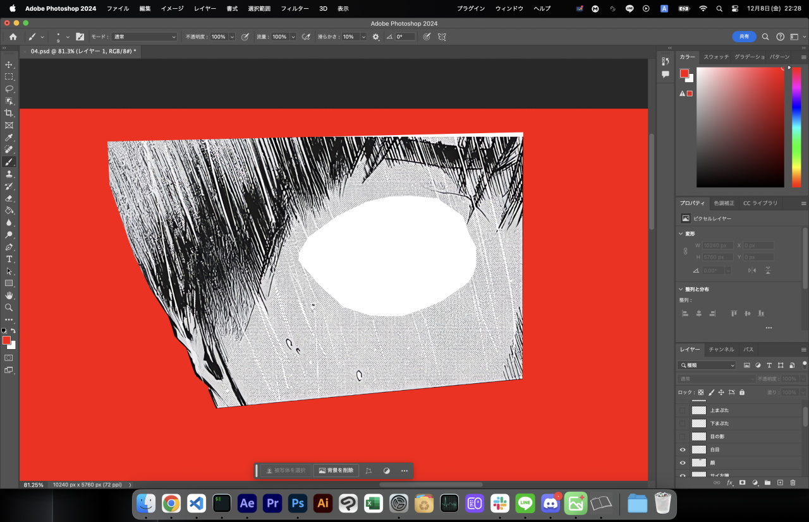
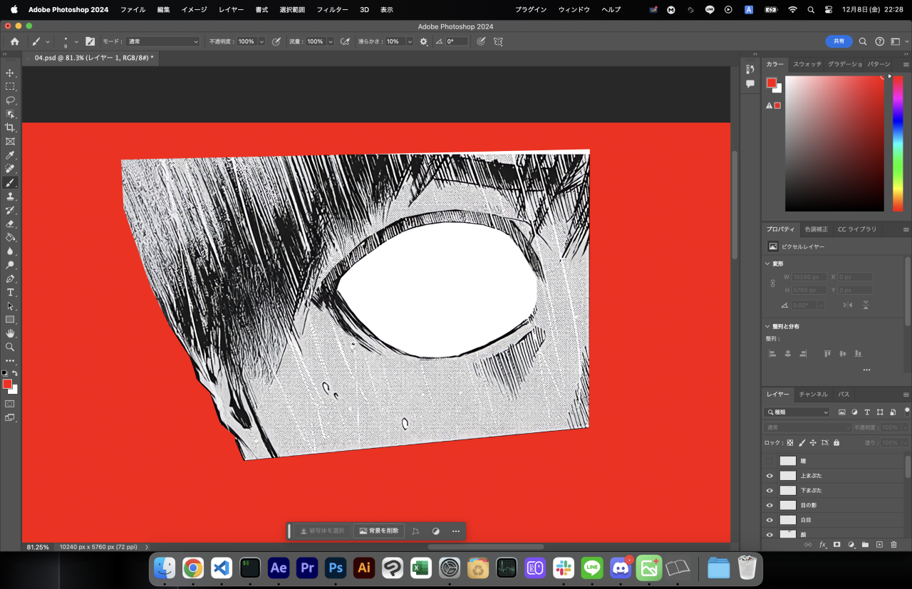
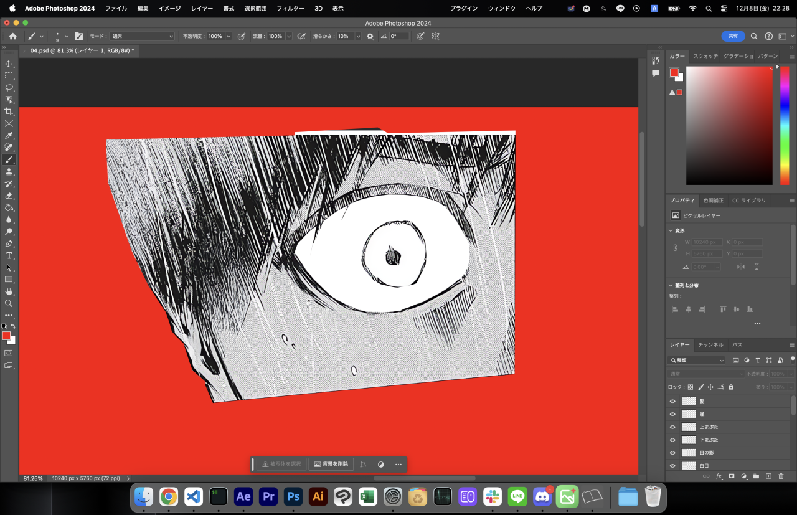
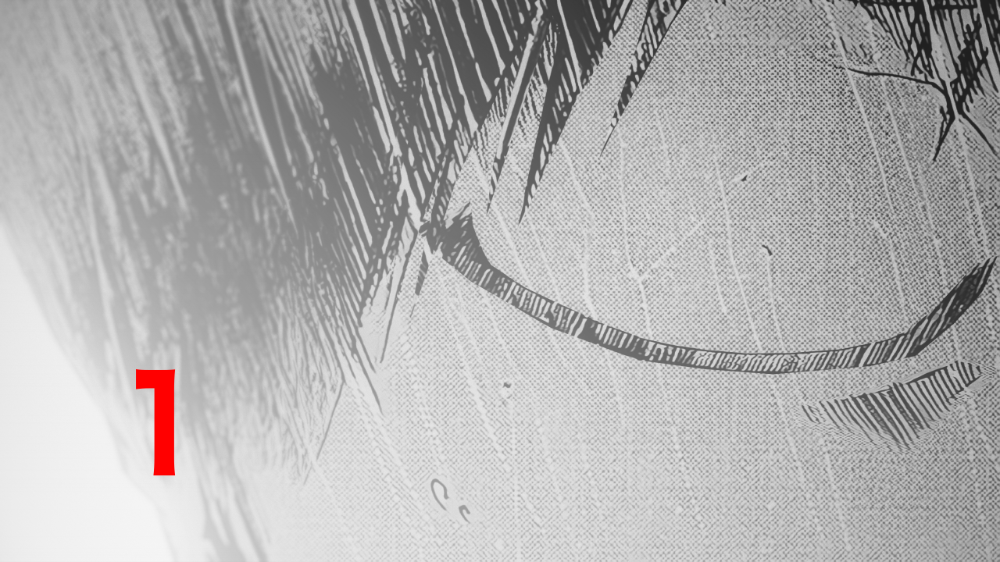
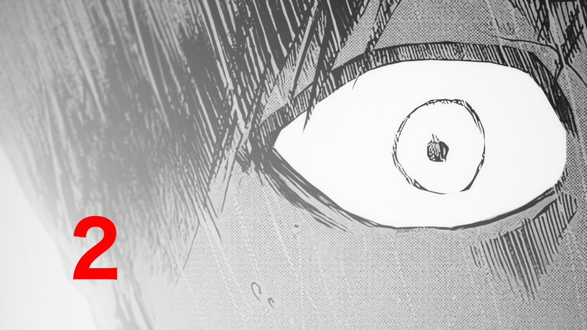
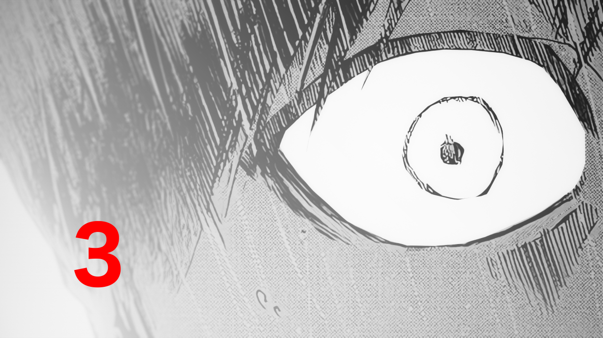
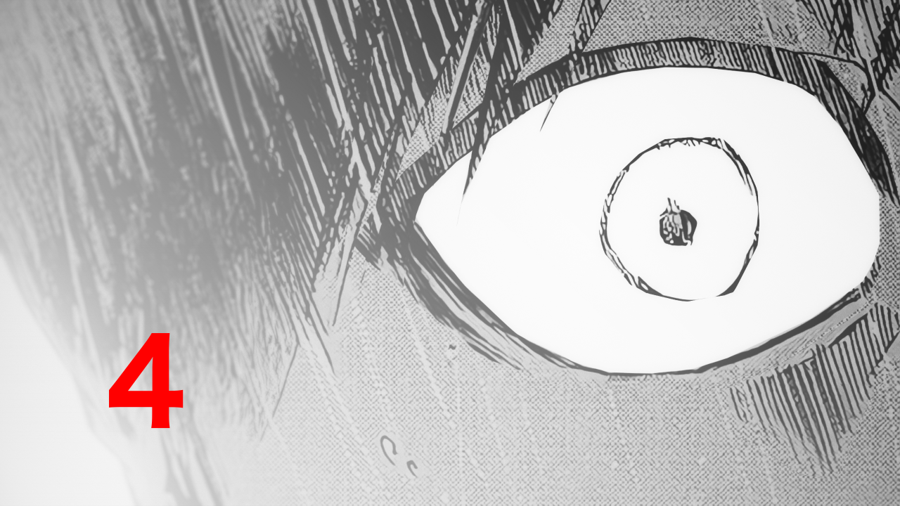

# どうした急に

なんか毎年この季節になるといろんな界隈でアドベントカレンダーとかいうのやるじゃないですか。あれ楽しそうだな〜と思って。でも主催とかやるのは面倒なので一人でこっそりと。

他の作者さんの制作時のこだわりとか技術的なアレコレとか、いっぱい聞きたい気持ちはあります。。。軽率にNoteとか使って書いてほしい。

<!--more-->

# 1\. 切り抜き＆書き足し

一番手前のものから切り抜いて、その切り抜いた分を書き足して消します。例）瞳を切り抜いたら瞳があった部分を白で塗りつぶす

切り抜く。上のレイヤーのパーツを消す。その繰り返しです。

一番下のレイヤーから並べるとこんな感じ。

書き足しは「コンテンツに応じた塗りつぶし（Shift+F5）」と「生成塗りつぶし」をメインに使います。ちゃんとやりたいときはスタンプツールとかも併用。

# 2\. 動かす

AEのパペットツールを使って動かします。パーツごとにポジションにキーフレームを打つだけのときもあります。

まばたきのアニメーションのコツは一気に目を開くようにすること。完全に目を閉じたフレームの次は8割ぐらい開いたフレームでスタートします。こんな感じで。

完全に閉じた目は上まつげを上下反転させて作りました。コンポジットは好みなので割愛（というか自分の中で正解がまだない）

完成するとこんな感じ。

<!-- \[video width="960" height="540" mp4="https://www.alinco.shop/wp-content/uploads/2023/12/mabataki.mp4"\]\[/video\] -->

 

# キャラモーション、うまくなりたい……

最近キャラモーションに価値を感じるようになってきました。よくよく考えると漫画が動くってすごい。

なんて内容の薄い記事。。。まぁ普段から何も難しいことしてないので、こんなもんです。キャラモーションがっつりやるようなタイプでもないですし。キャラモーションで言うとLive2D使ってる人のHow Toとか聞きたい。あれほんと謎。
