静止画MADや漫画PVなどのコンポジットを分類して、それぞれが与える個人的な印象をメモしてみる。目的に合わせてコンポジットを使い分けできるようになれたらいいよね。

<!--more-->

# Nanatsukiさん系

\[su\_row\]\[su\_column size="1/2" center="no" class=""\]

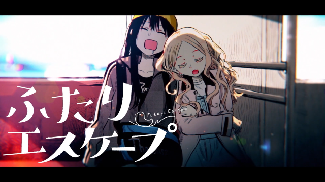

\[/su\_column\] \[su\_column size="1/2" center="no" class=""\]

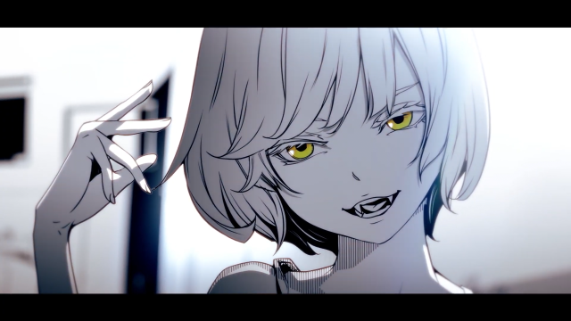

\[/su\_column\]\[/su\_row\]

\[su\_row\]\[su\_column size="1/2" center="no" class=""\]

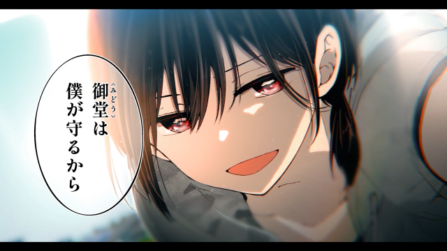

\[/su\_column\] \[su\_column size="1/2" center="no" class=""\]

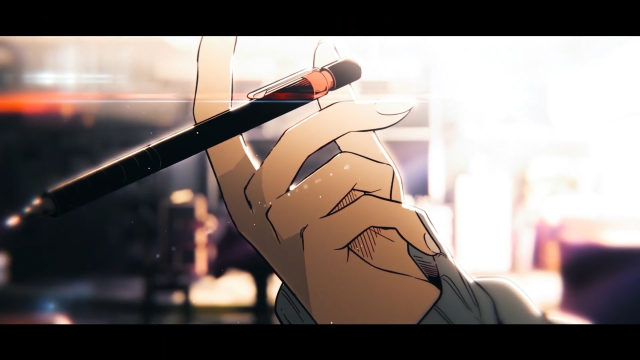

\[/su\_column\]\[/su\_row\]

\[su\_row\]\[su\_column size="1/2" center="no" class=""\]

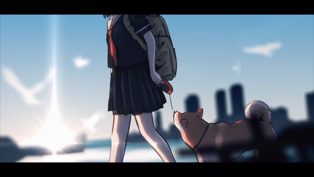

\[/su\_column\] \[su\_column size="1/2" center="no" class=""\]

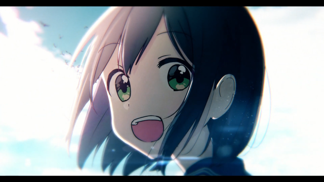

\[/su\_column\]\[/su\_row\]

- 特徴
    - コントラストが強め
    - 色をしっかり乗せる
    - レンズフレアやぼかしなどの効果を多用する
    - カラー素材との相性が良い
- 印象
    - 明暗がくっきり分かれててキレイ
    - 強く印象に残りやすい
    - 強調したいカットに使うと良さげ
    - 若干飽きられてる感がある
        - 解説がわかりやすくて皆真似しちゃうから……

# 牛丼さん系

\[su\_row\]\[su\_column size="1/2" center="no" class=""\]

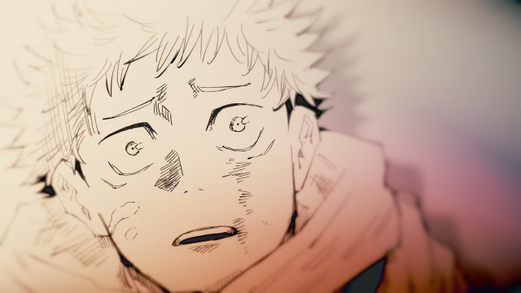

\[/su\_column\] \[su\_column size="1/2" center="no" class=""\]

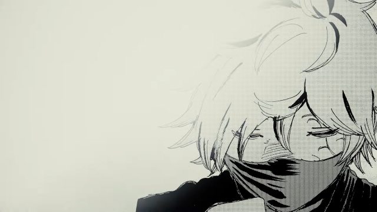

\[/su\_column\]\[/su\_row\]

\[su\_row\]\[su\_column size="1/2" center="no" class=""\]

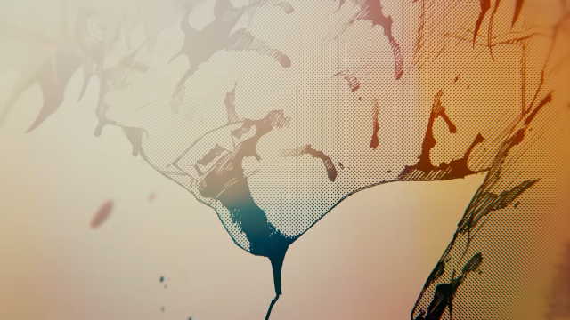

\[/su\_column\] \[su\_column size="1/2" center="no" class=""\]

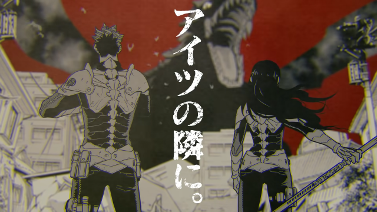

\[/su\_column\]\[/su\_row\]

\[su\_row\]\[su\_column size="1/2" center="no" class=""\]

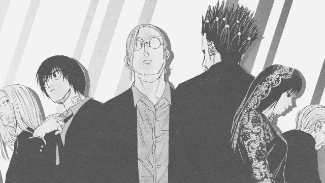

\[/su\_column\] \[su\_column size="1/2" center="no" class=""\]

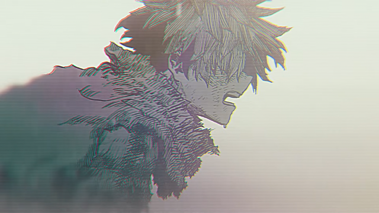

\[/su\_column\]\[/su\_row\]

- 特徴
    - コントラスト弱め
    - 暖色系の色が似合う
    - あまり彩度は高くない
    - 白黒素材との相性が良さげ
- 印象
    - シックな印象を与える
    - 公式っぽい感じに
    - 個人的に今一番アツい
        - 白は黒いほうが良いし、黒は白いほうが良い

# 単色合成

\[su\_row\]\[su\_column size="1/2" center="no" class=""\]

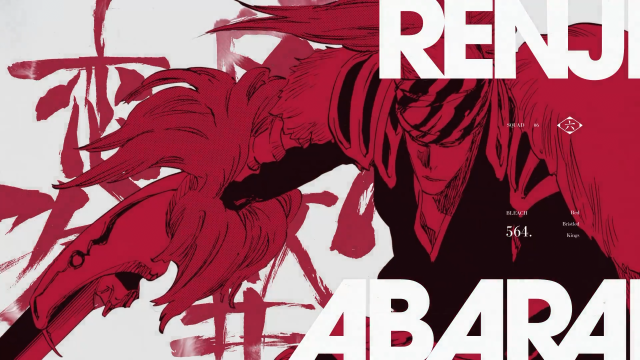

\[/su\_column\] \[su\_column size="1/2" center="no" class=""\]

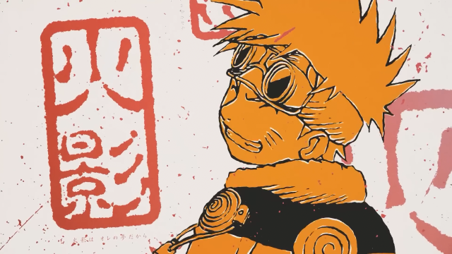

\[/su\_column\]\[/su\_row\]

\[su\_row\]\[su\_column size="1/2" center="no" class=""\]

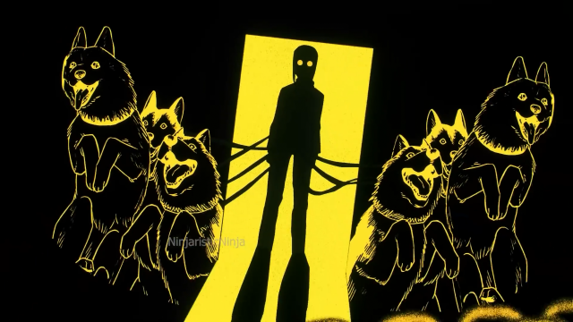

\[/su\_column\] \[su\_column size="1/2" center="no" class=""\]

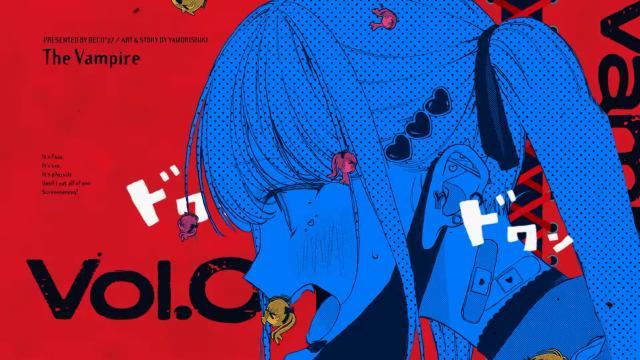

\[/su\_column\]\[/su\_row\]

\[su\_row\]\[su\_column size="1/2" center="no" class=""\]

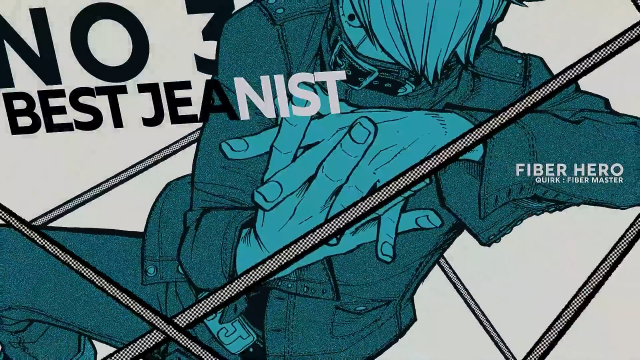

\[/su\_column\] \[su\_column size="1/2" center="no" class=""\]

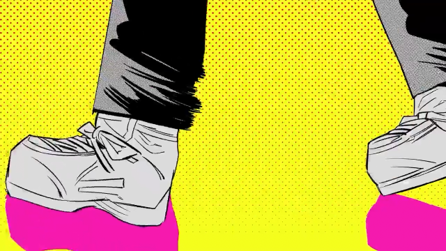

\[/su\_column\]\[/su\_row\]

- 特徴
    - 色かぶり補正で単色にするアレ
    - カラフル
    - ぼかしやフレア、ライトリークなどのカメラの効果を使わない（ことが多い）
- 印象
    - パキッとした印象を与える
    - タイポグラフィーと相性が良い
    - グラフィカルでポップな感じになる
    - キャラ紹介パートとかで使えそう
        - というかよふかしで使った

# 逆光

\[su\_row\]\[su\_column size="1/2" center="no" class=""\]

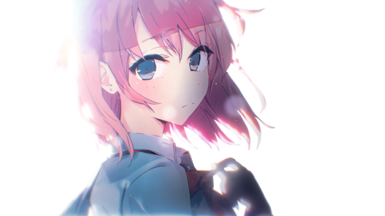

\[/su\_column\] \[su\_column size="1/2" center="no" class=""\]

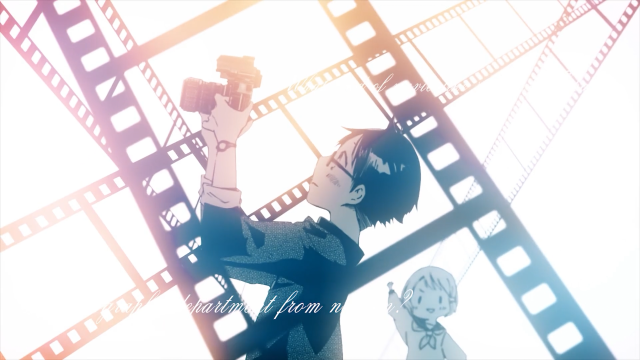

\[/su\_column\]\[/su\_row\]

\[su\_row\]\[su\_column size="1/2" center="no" class=""\]

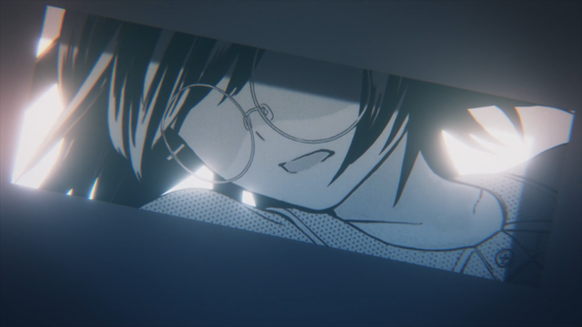

\[/su\_column\] \[su\_column size="1/2" center="no" class=""\]

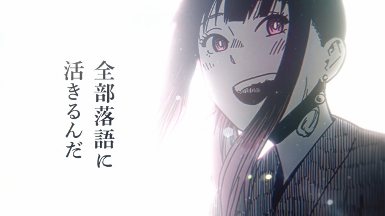

\[/su\_column\]\[/su\_row\]

- 特徴
    - 逆光
    - 白背景にキャラ置いてキャラ暗くしてグローかけるやつ
- 印象
    - 温かい感じ
    - 思い出みたいな
    - 回想シーンっぽいイメージある
    - 昔誰かに「ALINCOさん一年前からコンポジットこれしかやらんやん」って言われたの思い出して鬱になってきた
