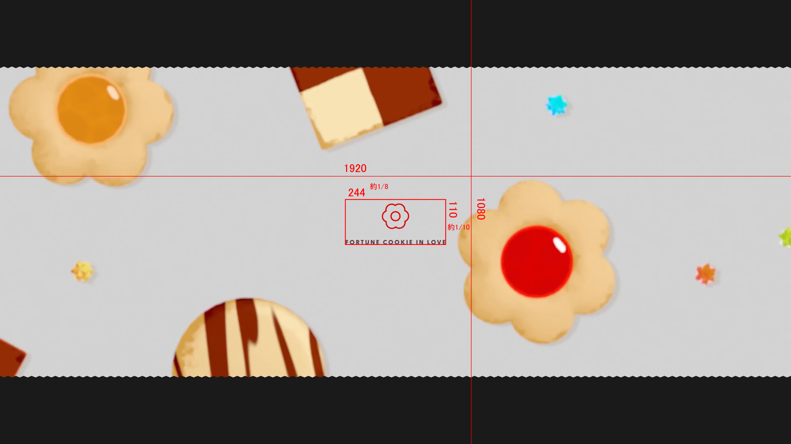
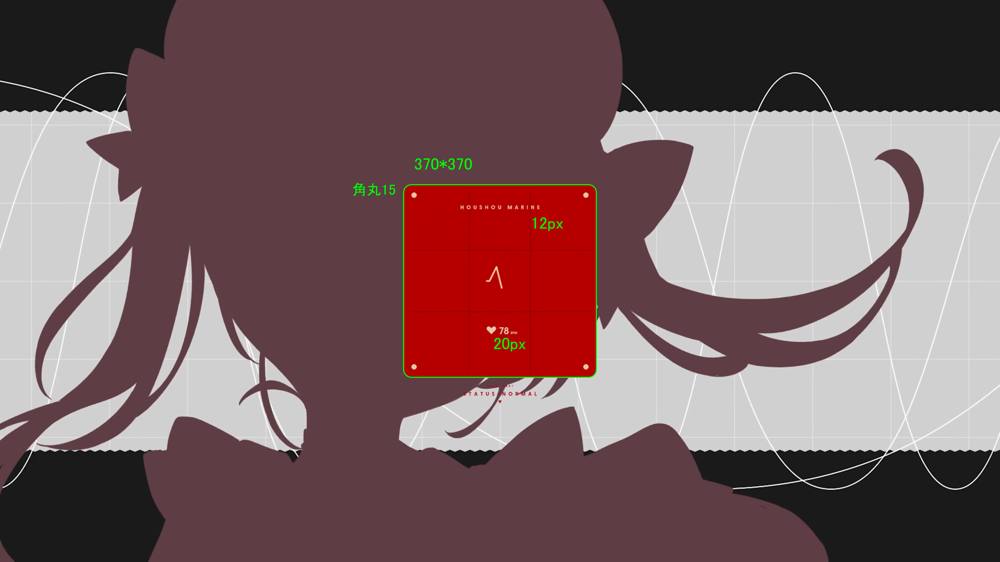
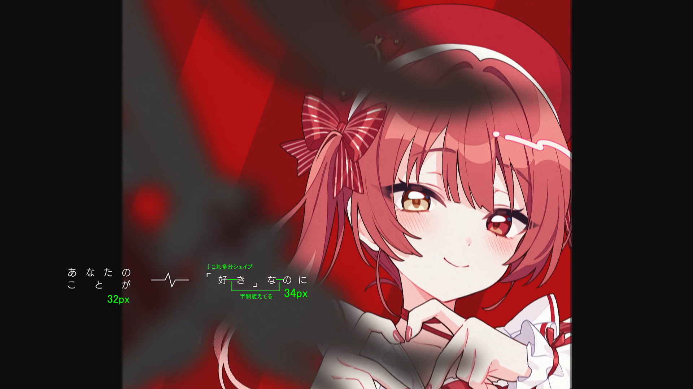
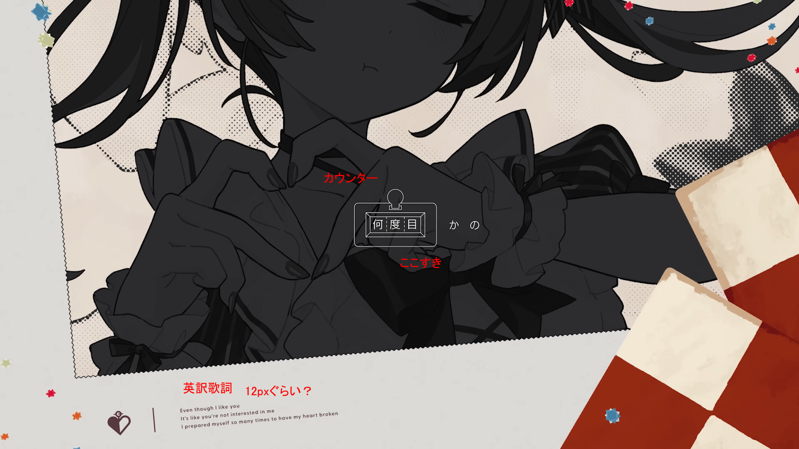
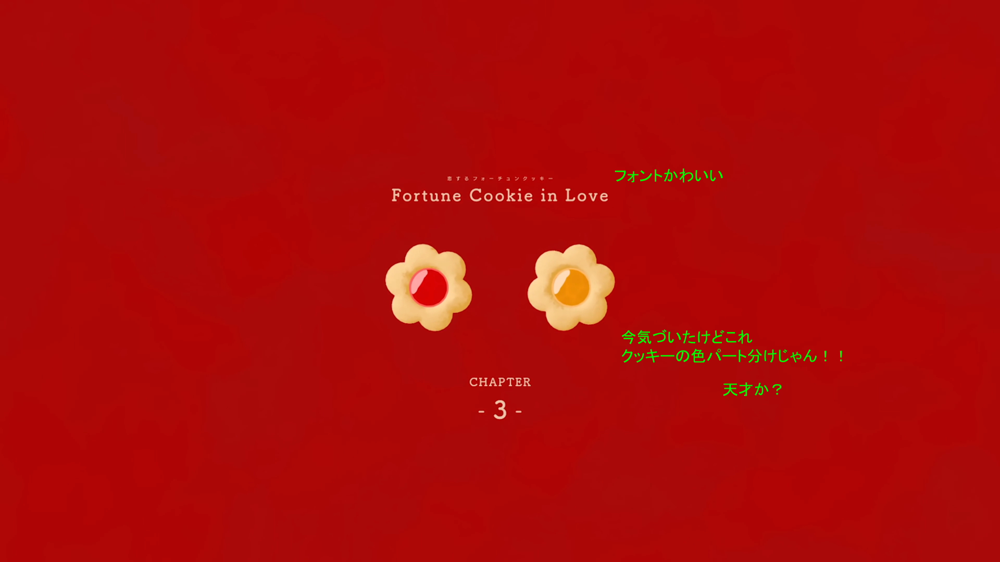
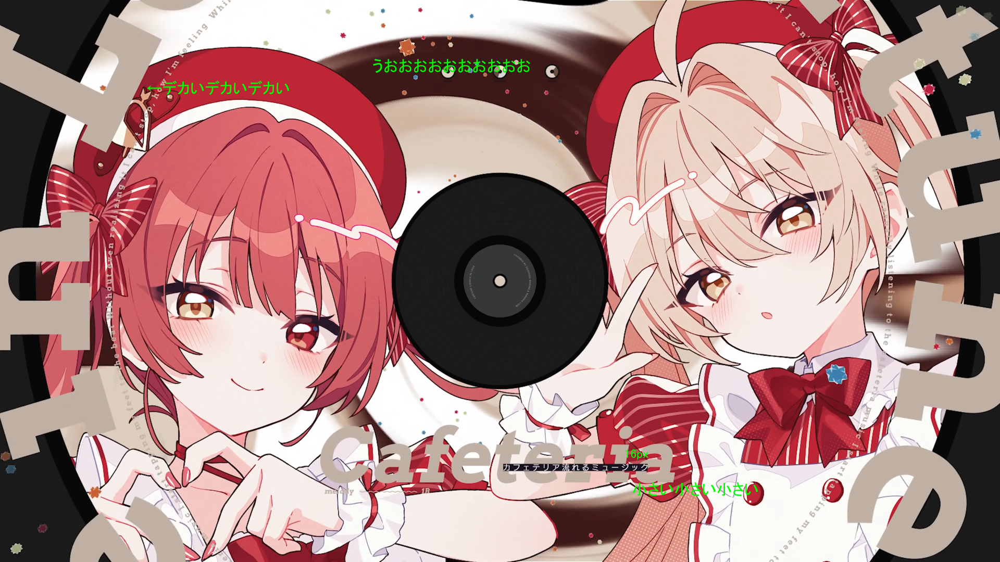
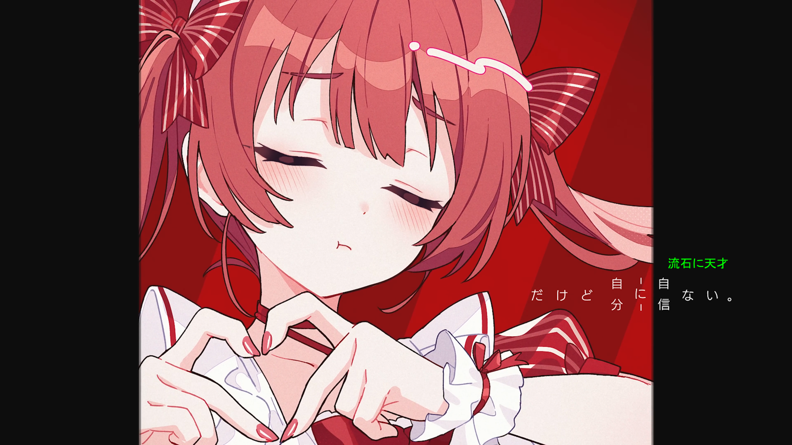
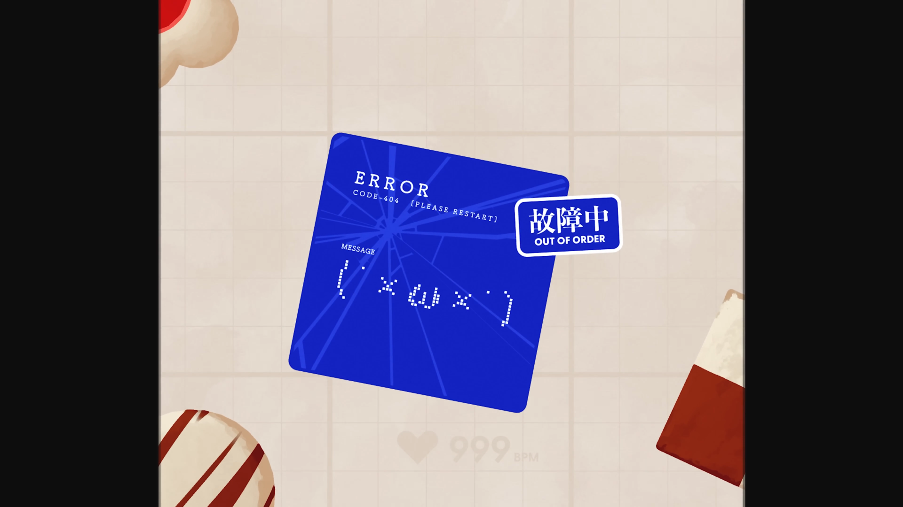
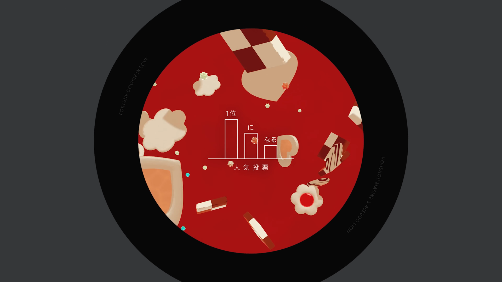

https://youtu.be/yilQ3KUhEpo?si=Ctl8DBgLH3OjYlcj

文字のサイズ感を見てみる。なお、コンポサイズは1920\*1080とする。

<!--more-->

# 0:02〜0:06

- 四角で囲ってみるとサイズはざっくり244\*110
    - 横が約1/8で、縦が約1/10のサイズ
    - だいぶ小さい
- 花のアイコンを若干下に下げてる
    - テキストが重いため？
    - 下げた分を引くと240×110かも
- テキストのサイズは18pxぐらい？

# 0:06:20

- 今度はど真ん中
- サイズは書いてある通り

# 0:29:12

- 「」←これをちゃんとシェイプで作ろうと思った
    - いや、シェイプじゃないかも
    - わからん……

# 0:35:12

- 気の利いたグラフィック好き

# 0:57:13

- このフォント、なんかの本で見たのに思い出せない

# 0:59:08

- デカいテキストはちゃんとデカい
- 小さいテキストはちゃんと小さい

# 1:49:12

- 縁取り、ロングシャドウ、縁取り
- 素の白テキスト（筑紫Aオールド明朝）をGG分解でバラバラにしてランダムな位置からバキバキイーズで登場させてるのガチで恥ずかしくなってきた

# 2:17:12

- 流石に

# 2:23:13

- ここすき
- 💗999BPM←すき

# 2:45:07

- ここもすき

脱線してきたので終了。

塚田サオさん、恥ずかしながら最近フォローさせて頂いたんだけど、サブ垢？の方はすでにフォローしてた。

[https://twitter.com/StudyTsukada](https://twitter.com/StudyTsukada)

ちゃんと練習してる人がちゃんと上手いのすごく希望になるな……と思った。俺もちゃんとしたい。
