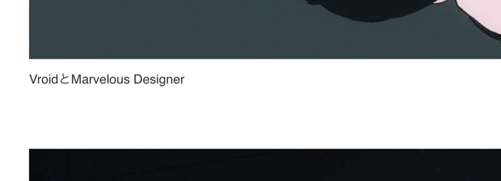

# VRoidを初めて触ってみた（2024/03/24）

仕事で「Blenderで3Dキャラ扱えたりする？」と聞かれて微妙な返事しか出来なくて不甲斐なかったので、勉強がてらVRoidで作ったキャラクターをBlenderに読み込ませて動かしてみる。

あと山口駿さんが今日Twittter(X)にログ？を上げててそれにVRoidって書いてたので触ってみたくなったのもある。

ref: [https://x.com/oumlr/status/1771698927626018918?s=20](https://x.com/oumlr/status/1771698927626018918?s=20)

<!--more-->

で、VRoidで適当にモデルを用意。操作がめちゃくちゃ簡単でびっくりした。（どうでもいいけど4Kのディスプレイで見るとモデルがガビガビなのは仕様？）

Blenderでの読み込みは特に困らず行けた。プラグインDLして有効化して普通に。

いざ動かしてみる。「ポーズモードってどれだっけ……」とか言いながらゴチャゴチャとボーンを動かして跪かせた。なんか右腕がボンレスハムみたいになってるのは気の所為？

左肘がエグいことになった。派手に曲げるとグジャグジャになるのを直す方法が知りたい。調べる。

こんなのが出てきた。シェイプキーってなんだ。

📝[アニメーションメッシュを破綻させないためのコレクティブシェイプキーの基本](https://mmd-blender.fandom.com/ja/wiki/%E3%82%A2%E3%83%8B%E3%83%A1%E3%83%BC%E3%82%B7%E3%83%A7%E3%83%B3%E3%83%A1%E3%83%83%E3%82%B7%E3%83%A5%E3%82%92%E7%A0%B4%E7%B6%BB%E3%81%95%E3%81%9B%E3%81%AA%E3%81%84%E3%81%9F%E3%82%81%E3%81%AE%E3%82%B3%E3%83%AC%E3%82%AF%E3%83%86%E3%82%A3%E3%83%96%E3%82%B7%E3%82%A7%E3%82%A4%E3%83%97%E3%82%AD%E3%83%BC%E3%81%AE%E5%9F%BA%E6%9C%AC)

## 📍シェイプキー

> シェイプキーとは、メッシュの頂点の位置を変化させることのできる機能です。シェイプキーの機能を使うことで、メッシュを頂点の単位で変形させることができます。

ref: 📝[シェイプキーによるアニメーション](https://blender3d.biz/simpleanimation3dcg_deformed_shapekeys.html)

- About
    - 表情変えたりするときに使うっぽい
    - 基本の形状を記録するシェイプキーと、変形後の形状を記録するシェイプキーの最低2つが必要
    - 変形前と変形後を0-100でアニメーションできる
    - シェイプキーはオブジェクトごとに管理される
- How to
    - オブジェクトを選択してデータタブをクリック
    - シェイプキーパネルでシェイプキーを2回追加する
    - 2回目に追加されたシェイプキーを選択
    - 値を1にしてから編集する

今回は参考動画に合わせてスカルプトモードのグラブで編集した。ボーンを動かした後の形状で編集するにはスカルプトモードしか無理っぽい？

一応白い部分がはみ出てるのは消せた。

# ハイキューTTTOPを見ながら手のアニメーションを作ってみる（2024/03/25）

サビ前の太陽を掴もうとする手の部分。ケレン味あふれる作画。

[https://youtu.be/cYrEN2Gt2\_g?si=OLQGo1K-X512UfEx](https://youtu.be/cYrEN2Gt2_g?si=OLQGo1K-X512UfEx)

そもそもBlenderでキャラクターアニメーションを作る流れを知らない。1フレームずつキーフレームを打つのは流石に違うと思いたい。

📝[Blenderでアニメーションを作る方法と流れを初心者向けに徹底解説！](https://udemy.benesse.co.jp/design/blender-animation.html)

NLAエディターってなんだ。

## 📍NLAエディター

> NLA を使うとアクションを再利用できる。歩きのアニメーションが必要になるたびにそのアクションからキーをコピーするのは不便だし、そのような運用ではアクションが修正された場合の作業量が大きくなりすぎる。

📝[Blender の NLA の使い方](https://dskjal.com/blender/nla-usage.html)

アニメーションをループさせる機能っぽい？（今回は関係なさそう）操作はちょっと記事見てもピンとこない。今度自分で触ってみよう。

📝[モーション作成のためのノンリニアアニメーションエディタ](https://qiita.com/yukimituki11/items/f74b4d4e85b2c4c012b9)

📝[【Blender】アニメーションで利用するエディターのクセを知る](https://note.com/info_/n/n3485c541285c)

よさげ記事。ドープシートって何。AEのタイムラインみたいなやつか。

↓作ってみた結果。コンポジットがバキバキなのは御愛嬌。握りこぶし難しすぎワロタ。

\[video width="1920" height="1080" mp4="https://www.alinco.shop/wp-content/uploads/2024/03/コンポ-2.mp4"\]\[/video\]

 

# 走りのモーションを試してみる（2024/03/29）

前に一回だけTutorial見ながらやった記憶がある。今回は[これ](https://x.com/leedoppo/status/1407428178503561216?s=20)を見ながら。

## 📝動きをループさせるには

前回調べたNLAエディタを使う。ドープシート > アクション でストリップ化。NLAエディタで開いてアクションクリップ > リピートの数値を上げるとループする。

Ctrl+Shift+Vの反転コピペが上手く行かない。。。なんか前もこんなことあった気がするぞ！

原因わからなかったので手打ちで反対側も動かした。一応走ってるっぽい感じにはなった気はする。なんか違和感あるけど。

\[video width="1024" height="532" mp4="https://www.alinco.shop/wp-content/uploads/2024/03/画面収録-2024-03-29-13.42.00.mp4"\]\[/video\]
