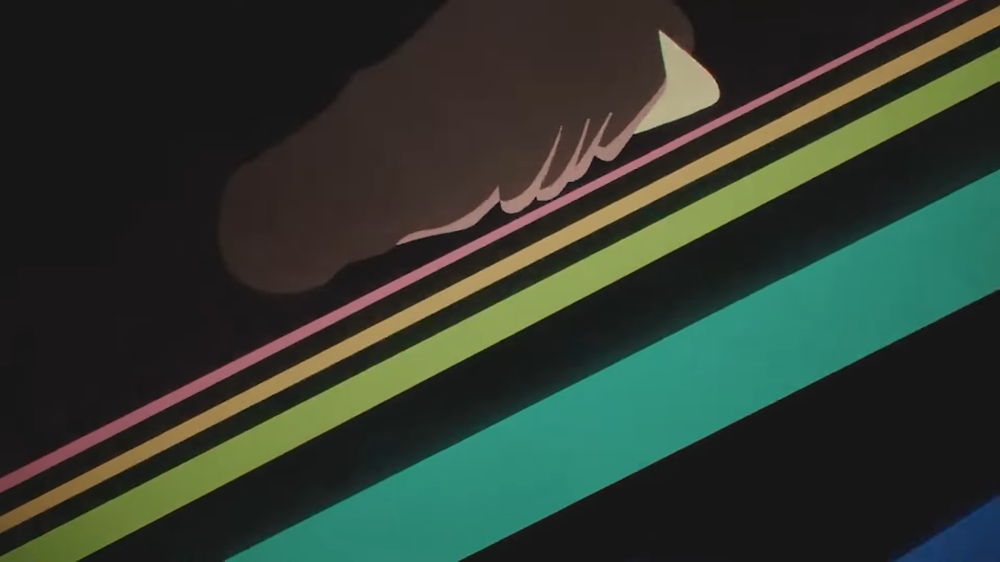

第17回ANIMAAAD祭が始まりましたね。自分は複合で参加しました。よければ見てやってください。

[【複合MAD】仮想現実の夜を縫って](https://www.nicovideo.jp/watch/sm43701243)

この記事では前々から思ってた「MAD作者はいつ死ぬのか」という話をしてみます。ごく個人的な感覚の話なのであしからず。全員がそうだとは思わないけど自分はそう。眠いので適当ななぐり書き。

<!--more-->

# MAD作者はいつ死ぬのか

友達ができたときです。

すみません、ちゃんと説明しますね。要するに「MADを作らなくても繋がっていられる関係が出来たとき」です。

MADを作る理由の一つに「わかってほしい」という欲求があります。このアニメの良さ、この曲の良さ、この組み合わせの良さをわかってほしい。これは全てのMAD作者が持つ感覚だと思います。共感してほしいし、共感させたいですよね。わかり合いたい……。**この欲求はMADの友達ができると消えます。**

一緒にゲームをする仲だったり、飲みに行く仲だったり、（MAD友達の解像度が低い）そういう関係がMAD経由でできると多分自分はMADを作らなくなります。**いや、別に友達作りたくてMAD作ってるわけじゃないんですよ！！**ないんですが、多分作らなくなると思います。多分。だって満たされるから。

飢えなんですよね結局。共感に対する飢え。これが一番の原動力。作らなくてもわかってくれる人が身近にいいたらそりゃ作らないって。

ええそうです。自分はもともとの性格もあり、自分から積極的に絡みに行くようなタイプではないので、MAD界隈に友達がいません。ぼっちです。ぼっちざろっくです。でも、それでいいんです。逆にそうじゃないとダメ。MADを作り続けたければ孤独であるべきなんです。（孤高って言いたかったけどそう呼ぶにはあまりにも才能がなさ過ぎる……）

**『MADを作り続けることこそが唯一、微弱な繋がりを保つ方法』**←これが理想です。微弱な繋がりというのは、投稿したMADの感想をつぶやきあったり、ツイートにいいねを押したり押されたり、そんな些細な関係のことです。自分はその程度の関係で十分なんです。

つまり結論。

# 俺に伊地知虹夏は要らない

ぼっちはぼっちのままMADを作り続けることが出来たら良いなと思います。ここまで読んでいただきありがとうございました。

あ、あと黄金祭マジで間に合わないかもです……。

追記：案件を受けるようになったり、進学や就職で生活が変わっても死にます。てかこっちのほうが死因として正しいだろ！！
