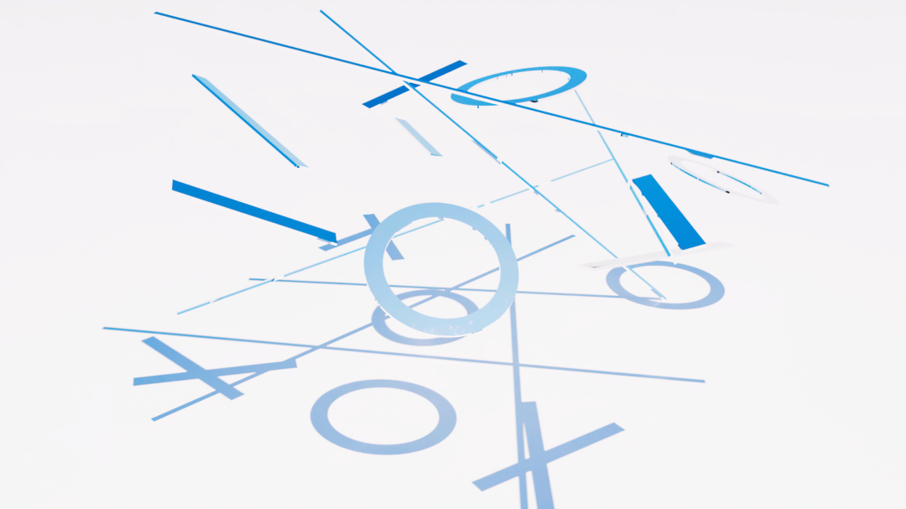
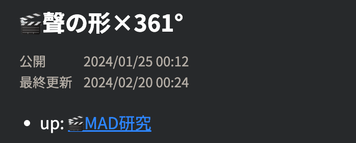
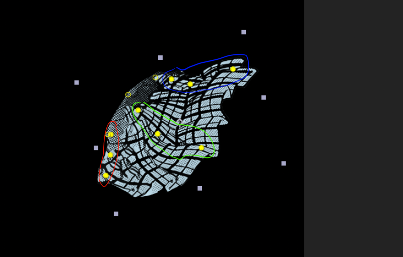
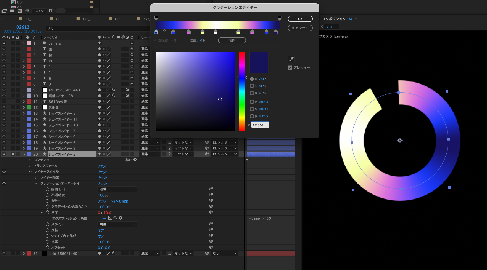

https://youtu.be/9F51AtDg9Ok?si=qehs-5OVxrlGcZXI

 

記事タイトルは本当につけたかったタイトル。時速36kmの楽曲「スーパーソニック」の歌詞「良し悪しの向こう側で会えたらまた会おうぜ」から引用。めちゃくちゃ好きなフレーズ。でもこれだとタイトル見た人に「時速の曲か！？」って勘違いさせてしまうかも……と思って別の似たような言葉を探した。

結果見つけたのが「Somewhere beyond right and wrong, there is a garden. I will meet you there.（善悪を超えたどこかに庭園がある。そこで会いましょう）」という詩。13世紀のペルシャのルーミーと言う詩人の言葉。（ReferenceのRumiさん。タイトルの引用元ということで）映画「ダイアナ」のラストシーンで引用されたらしい。全部は長いので「善悪を超えたどこかで」に。この動画のタイトルに据えた理由は割愛。

<!--more-->

# 3ヶ月弱かかった

1月末スタートで完成が5月頭？？？ ありえん……。何にそんな時間かかったのマジで。

真面目にMADを作ろうと頑張ったけど、結果的に不自由な感じになってしまった気がする。真面目と自由は両立させれるはず。頑張りましょう。

Vコンの作り方が悪かった気もする。まぁ初めてのVコンだし……。初めてではないか。

キャラモーションから逃げなかったのはえらいと思う。動かすところは頑張って動かした。（当社比）

なんか技術的にメモしておくことあるだろうか。あ、あれ書いとこう。

# 技術的備忘録

## スカートのモーション

ぼっくりさんに教えてもらったやつ。赤緑青のそれぞれに AutoSway をかけてる。それぞれが別の揺れ方をするので複雑な動きを作ることができる。

1枚のレイヤーに複数回 AutoSway かけるという発想がなかった。賢い。

## 円形グラデーション

レイヤースタイルを使った。やり方は知ってたけど動画内で使ったのは初めてかも。エフェクト使えば別の方法もありそう。ところでこの謎サークル、どういう意味があるんです？

# 最終日強すぎワロタ

泣いちゃった。チェリーボムMMGC2024で一番好きかも。

# 次回作は？

AniPAFE参加作品の前に静止画を1個ぐらい作りたいかも。それか作り溜めてAniPAFEとMCLをそれぞれ別の作品で参加するのもアリか。作りたいソースはそんなに多くはない。作りたい曲はいっぱいあるのに。
