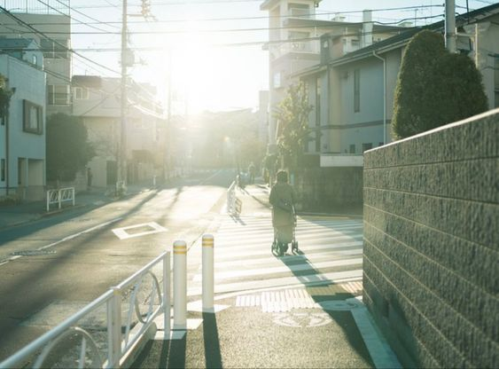
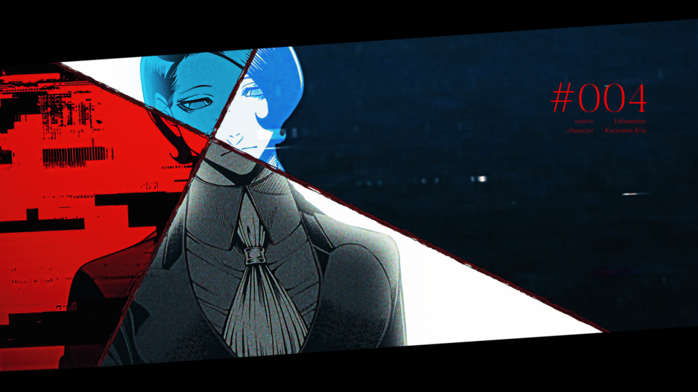
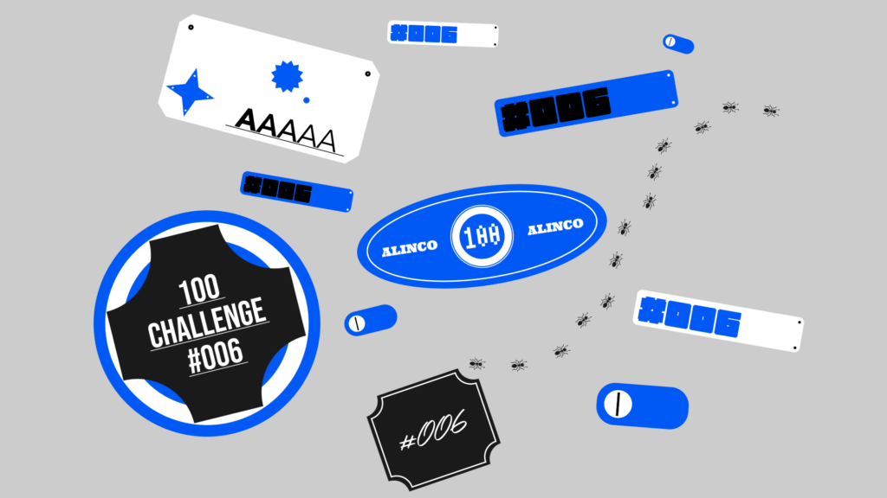

# About

2024年の目標にしていた映像100日チャレンジをやる。

# Rules

- 内容に指定はない

- 静止画でも動画でもOK

- 絵でもデザインでもモーショングラフィックスでも何でもアリ

- アウトプットを100個出す

- 毎日やらなくても一日複数やってもOK

- 始める前に課題を自分で考えてから進めていく

- 作ったものはTwitter(X)に上げる

<!--more-->

# #001

課題：SUPER BEAVERの「ささやかな」のアルバムジャケットを曲の雰囲気や内容を考慮して制作せよ

## Thinking

- 曲の雰囲気・内容

- 早朝の時間帯のイメージ

- 朝焼けみたいな

- 雨上がりの朝焼け？

- 最後の歌詞は「未来は見える」
    - 前向きな終わり方

- シンプルに写真とか風景イラストとかが良さそう

- グラフィックは入れるにしても最小限に

- モチーフは水たまりに映る朝日とか

- 角度的に水たまりに太陽が映る時間帯は早朝じゃないんだよなぁ………

- 水面反射はアリ、採用

- 角度によっては見えないこともないか

- コントラスト強めのインパクトのあるデザインにしたい

## Reference

## Output

# #002

課題：情報量の多いポップなトランジションを制作せよ

## Thinking

- 横方向と縦方向と前後の3種類作るか

- 3Dの小物とか使ってもいいかも

- ポップで何にでも使えそうな汎用性高い感じのやつがいい

- いい感じなら配布してみよう

- 情報量多くするには
    - パーティクル必須
    
    - Stardustで3Dモデル散らすか
    
    - ヨツベも使えるかも
    
    - 色数が多いと情報量多く見える気がする
    
    - レイヤーを複数の層で感じさせるとよい

## Reference

## Output

横だけで力尽きた。

## Review

- Liquid Transitionとヨツベ大活躍

- パーティクルは大小用意してサイズのコントラストを出して大の速度を上げる

- 黒があると画面が締まる

- くろべさんに「グラデがリッチになったね」と褒められた（やったね
    - これから毎回VC Color Vibranceかけちゃうぞ〜

# #003

課題：以下の10曲のイメージに合う5色以内の配色を考えよ

1. ロケットサイダー - ナユタン星人

3. 少年少女 - 銀杏BOYZ

5. ミカクニンハスキー - sanetii

7. いっかい書いてさようなら - 名取さな

9. 夢路 - nano.RIPE

11. ごめんねオデッセイ - amazarashi

13. ルバート - ヨルシカ

15. シャイニング - 時速36km

17. セツナレンサ - RADWIMPS

19. swim - 04 Limited Sazabys

## Output

↓ちなみにこっちはくろべさんがやったやつ。わりと共通認識ありそうでおもろい。

# #004

課題：キャラを分断してコンポジットを変える画面を試作せよ

## Reference

## Output

# #005

課題：1920\*1080のコンポでテキストサイズ12px以下の制限を元にグラフィックを作成せよ

## Thinking

- クソデカテキストを使えないのでシェイプでなんとか全体の形をざっくり決めてやらないと

- いや、別にデカいオブジェクトなくてもいいのか

- めっちゃ時間はかかりそう

- チマチマやっていこう

- 例によってイラレアンチなのでAEで作る

- いい感じならモーションさせる

- シェイプ化して変形した文字は12px以下縛りに含まれないことにする（許せ）

## Text

- 100 challenge

- #005

- minimum graphics

- under twelve text

- minimum shapes

- ALINCO

## Reference

## Output

# #006

課題：ステッカーのグラフィックをイラレで制作せよ

## Thinking

- イラレだああああああああ

- うおおおおおおおおおおおおおおお

- ステッカーのグラフィック、ぱぱっと作れるようになってMVに盛り込みたいわね

- ステッカーと言えば虹色のアレ

- 色はモノクロ+単色が引き締まって良さそう

- いっぱいフォント使えばそれっぽくなりそう

## Reference

## Output

## Review

- 虹色のやつ忘れてた

- アーチ状の文字配置とか試せばよかったかも

- イラレ回は定期的にやろう

# #007

課題：自室にある物で一番カッコいい、優しいと思うモノの写真を一番魅力が伝わる形でそれぞれ撮影せよ

## Thinking

- カッコいい形状ってなんだろう

- 優しい形状はわかる気がする
    - 丸っこければ優しい
    
    - じゃあ逆に尖ってたらカッコいい？

- 別に形状を気にしなくても平面のものでもいい気がするけど、それじゃ写真の意味がないからなにか立体のものがいい

- 機械とか人工物がカッコよく感じる（男子中学生）

- 持ってるガジェットの中だとMX Master 3Sが一番カッコいい形をしてると思う
    - 流線的な形状
    
    - スポーツカー見たときにかっけ〜ってなるのと同じ感覚

- 機械はやめようかな、なんか恥ずかしい

- そもそもアレだわ、俺の部屋モノが少なすぎてアレだわ

- カッコいいものがなさ過ぎたので優しいものだけにします

## Output

部屋で一番優しいモノ（モニター裏のランタン）

## Review

- 優しさが伝わる構図ってなんだろう……って思いながら適当に三分割法を意識して写真撮った

- ランタンの温かい色味が伝わればいいなぁと思って色温度の設定めっちゃ上げたりした

- あと暗くしたり

- 優しいってなんだ？？？？

# #008

課題：グラフィカルなグリッチのトランジションを制作せよ

## Thinking

- はい来ましたグリッチ回

- グラフィカルなグリッチとは
    - にへさんのモザイク使ったトランジションとかグラフィカルな感じある

- なんかテキスト使ったりして

- こういうのは考えるより手を動かしたほうが良い

## Output

## Review

- 制作時間30分ぐらい

- グリッチにも流れがあると美しい気がした

- インパクト -> 細かい感じ -> 大雑把な感じ みたいな

- 別にグラフィカルではないな

# #009

課題：Blenderで3Dの小物を簡単にアニメーションさせよ

## Thinking

- 3D回キターーーーー！！！（地獄）

- MVでなんかちょっとした3Dの小物を出すやつあるじゃん

- あれやりたい

- ぱぱっと出来るようになりたい

- Blenderなんて使うの何年ぶりだよ

- 基本操作すら怪しい

- 小物何にしよう

- なんか使い勝手の良いモチーフがいい

- モデルは適当にフリー素材を拾ってこよう

## Reference

https://youtu.be/rtHi7P5tb\_s?si=ERmVB5GQVQ9gnZGB

[https://cgbox.jp/2023/07/27/blender-geometrynode-random](https://cgbox.jp/2023/07/27/blender-geometrynode-random)

## Output

- 結局アニメーションさせてねえ

- ただBlenderの操作方法を思い出すだけの回になってしまった

- EEVEEの印象が昔よりかなり良くなったかも

# #010

課題：グラフィカルな効果線を試作せよ

## Thinking

- グラフィカルな（口癖）

- フラクタルノイズ感を消したい

- アニメーションのおばけ表現みたいな質感

## Reference

## Output

## Reivew

- Stardust大活躍

- クッソ重い

- これただのRectangleだけど、Textureにしてテーパーかけたシェイプとかにすればもっとよかったかも

- なんかビームみたいだなこれ
