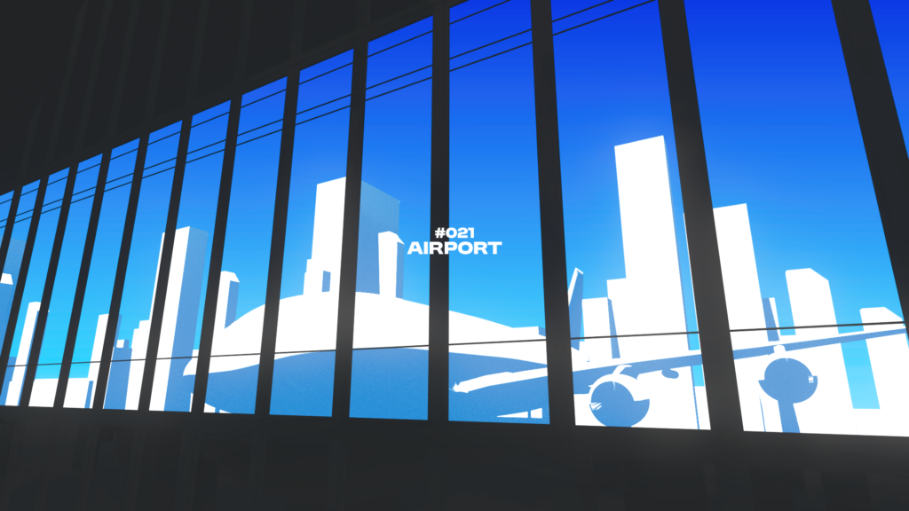

<!--more-->

# #021
完成日：2024/08/12（月）

課題：空港の広い窓みたいなアレを作れ

## Reference

## Output
<!-- 

 -->

## Review
- C4Dで窓をモデリングしてBlenderで色々やって画像書き出してAEで色つけた
- 本当はBlender内で全部制御できたらカッコよかったけど、セルルックのマテリアルがよくわからんかった
- 今度またセルルックチャレンジしよう
- てかEEVEE反射できるようになっててワロタ

# #022
完成日：2024/08/17（土）

課題：Eagleで曲を分類せよ

## Output
<!-- 

 -->

https://x.com/ALINCO2020/status/1824583580502413746

# #023
完成日：2024/08/18（日）

課題：キャラモーション練習

## Thinking
- 映画ヒロアカが良すぎたので中村豊みたいな緩急のやつを

## Output
https://x.com/ALINCO2020/status/1825172910442750107

# #024
完成日：2024/08/20（火）

課題：↓これモーションさせろ

## Output
https://x.com/ALINCO2020/status/1825789737849991242

# #025
完成日：2024/08/22（木）

課題：マーカーで引いたような文字のアニメーションを制作せよ

## Reference

## Output
https://x.com/ALINCO2020/status/1826434827878629449

## Review
- 以下手順
- ーーーーーーーーーーー
- フォントはハルクラフト
- CuttanaNirでアニメーションと質感作る用の素材を作る
- なぞるためのパスだけ残してUtility Boxで線をいい感じに複製
- AL\_PropBox2でトリミングを消したり透明度を100に戻したり線幅ランダムシードガチャしたり
  - AL\_PropBox2、指定の値を決め打ちする機能が要るな（今はランダムのminとmaxを同じ値にして実現してる）
- ラフエッジかけたりフラクタルノイズでマットしたりして質感を足す
- 書き順通りに下の線が消えるようにするためにレイヤーの順番に気を使った
- ーーーーーーーーーーー
- これ多分フォトショかイラレ使ったほうが早い………
- 静止画グラフィックの質感はフォトショかイラレで作るようにしよう
- なんでもAEでやろうとするのはマジで悪癖
  - 動かさない部分ならAEでやる必要ない
- フォトショ＆イラレと和解せよ

# #026
完成日：2024/08/25（日）

課題：イラレで作るみたいなグラデーションをAEで制作せよ

## Output
https://x.com/ALINCO2020/status/1827615195759571367

# #027
完成日：2024/08/30（金）

課題：AEパズル「軌道」

## Output
https://x.com/ALINCO2020/status/1829502644379103429

## Review
- S\_エフェクトが鍵

# #028
完成日：2024/09/02（月）

課題：AEパズル「のび～る系」

## Reference

## Output
S\_WarpRepeatでいける。

https://x.com/ALINCO2020/status/1830508636994777332

# #029
完成日：2024/09/02（月）

課題：荒い線のアニメーションを制作せよ

## Reference

## Output
https://x.com/ALINCO2020/status/1830535605400555907

## Review
- 1フレームに魂宿ってなさすぎ
- 残像の描き方がわからなくてメチャクチャな感じだけど勉強すればわりと見れるようになりそう
- キレイな線の引き方がわからんね

# #030
完成日：2024/09/02（月）

課題：エフェクト作り「斬」

## Thinking
- 油絵みたいな質感をどこまで出せるかが勝負
- できれば3次元でアニメーションさせられるように組む

## Reference

## Output
https://x.com/ALINCO2020/status/1830579904909553746