<!--more-->

# #031

課題：アニメっぽい効果線を試作せよ

## Reference

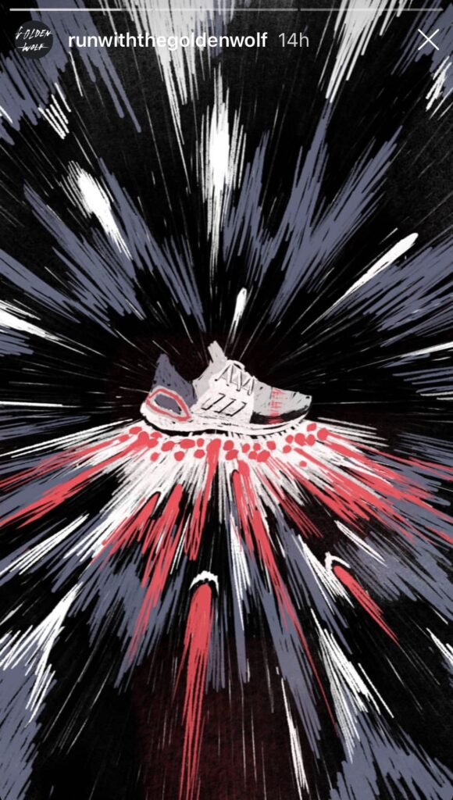

## Output

# #032

課題：#030のエフェクトをC4Dに持っていって変形させる

## Output

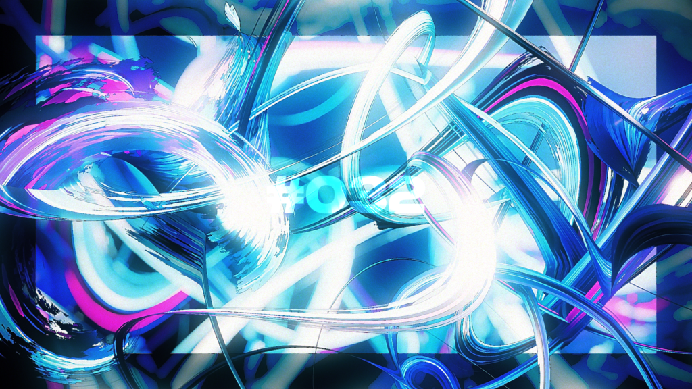

# #033

課題：油絵みたいな質感を試作せよ

## Output

失敗。プレビューだといい感じなのに書き出すと微妙になる。

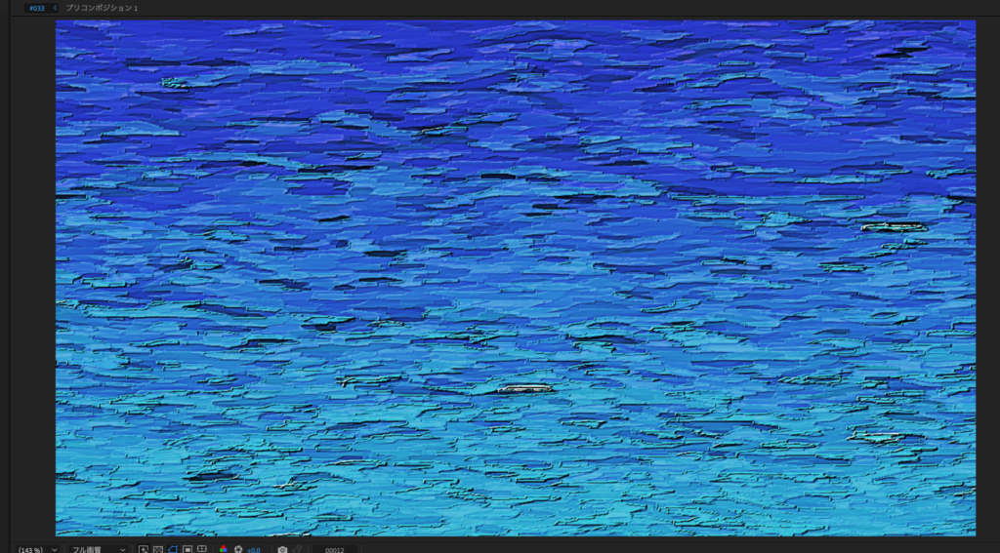

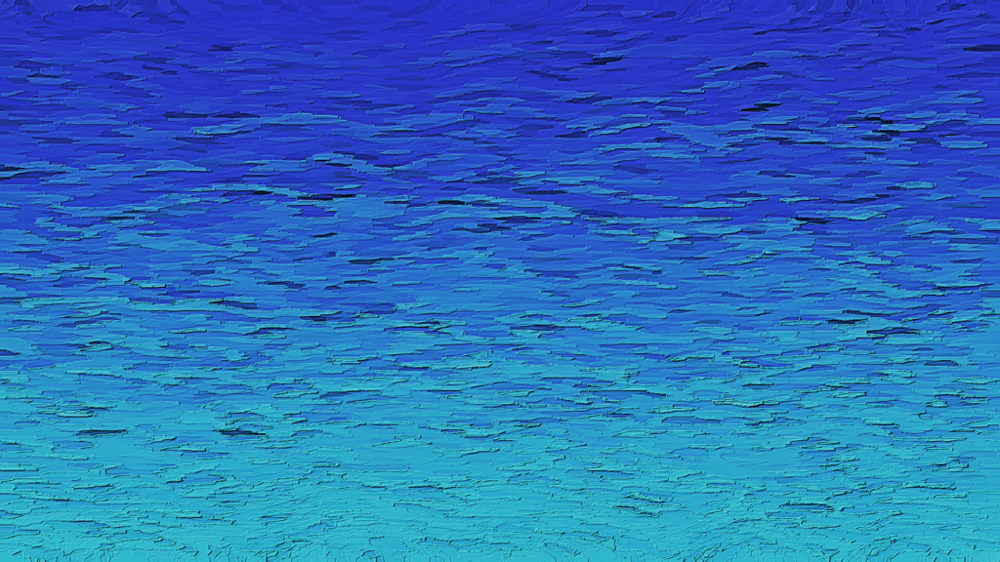

# #034

課題：お気に入りフォントをまとめて新しいフォントを開拓せよ

## Output

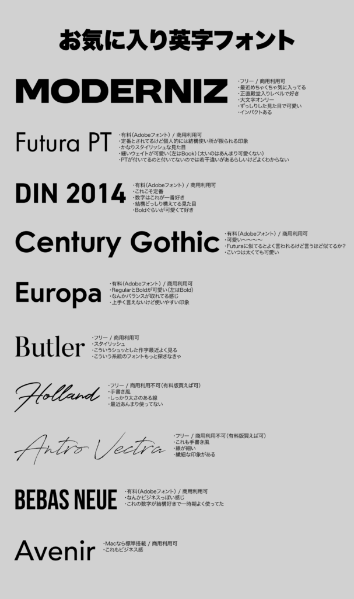

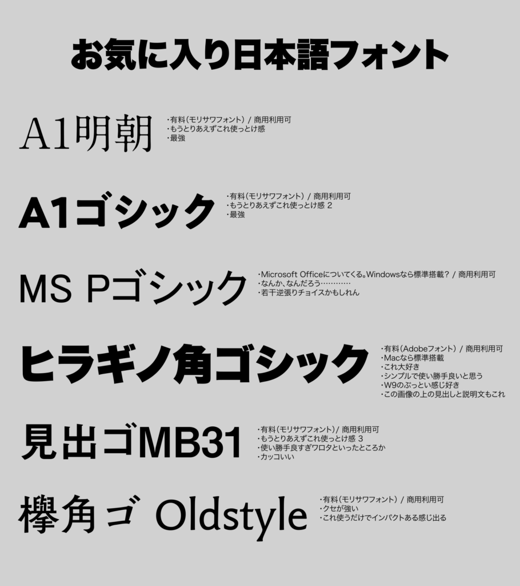

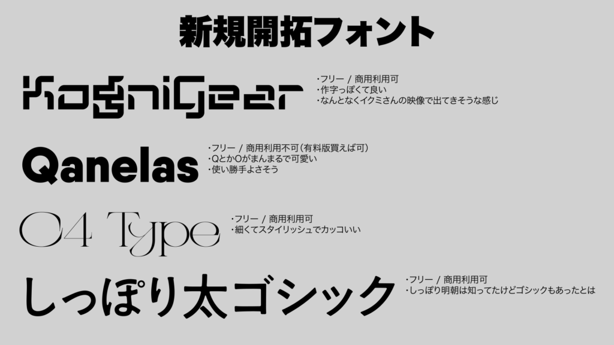

# #035

課題：なんか作れ

## Output

## Review

- 手癖すぎてカス

- Stardustでプリミティブ飛ばすときにsize randomが100のレイヤー1個だけじゃなくて、小さい奴らとデカい奴らのレイヤーをちゃんと分けるようになったのは偉いと思う

# #036

課題：「色」がテーマのモーショングラフィックスを制作せよ

## Thinking

- きみの色がよかったので

- 色は長さの違う光の波

## Reference

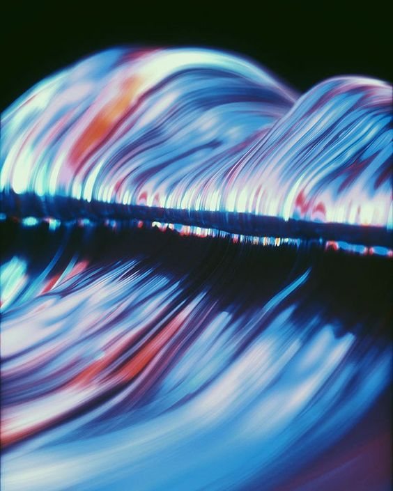

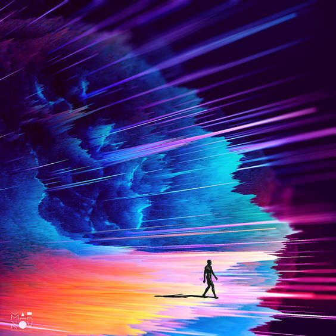

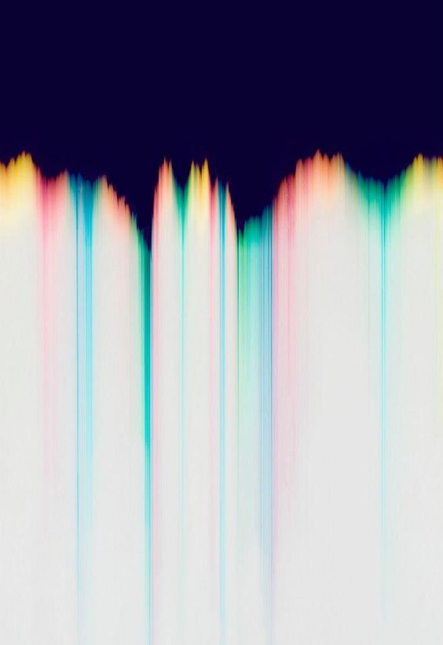

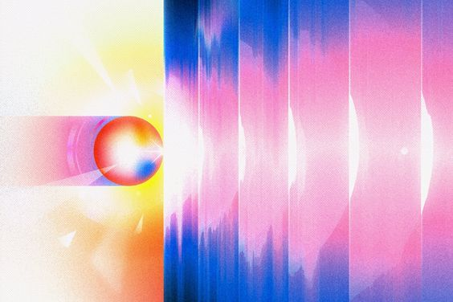

## Output

# #037

課題：AEのエクスプレッションのsampleImageメソッドを理解せよ

## Output

# #038

課題：↓こんな感じのやつをAEで

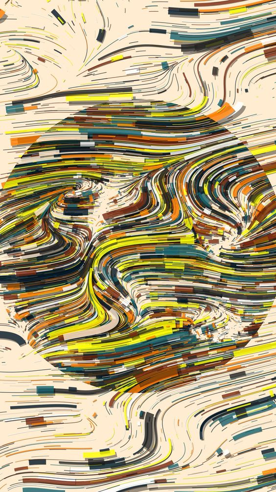

## Output

# #039

課題：映画みたいなルックのコンポをやれ

## Reference

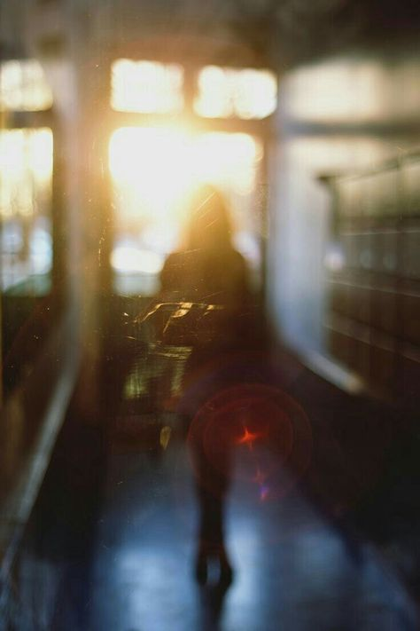

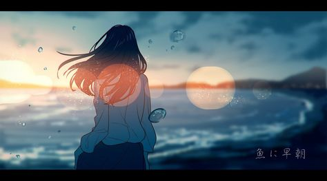

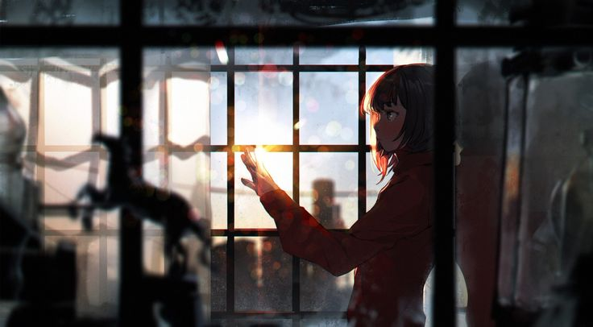

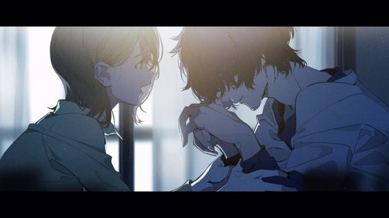

## Output

# #040

課題：かなり汚す系のコラージュ動画を制作せよ

## Reference

https://twitter.com/spikecrush/status/1831364202914865367

## Output
