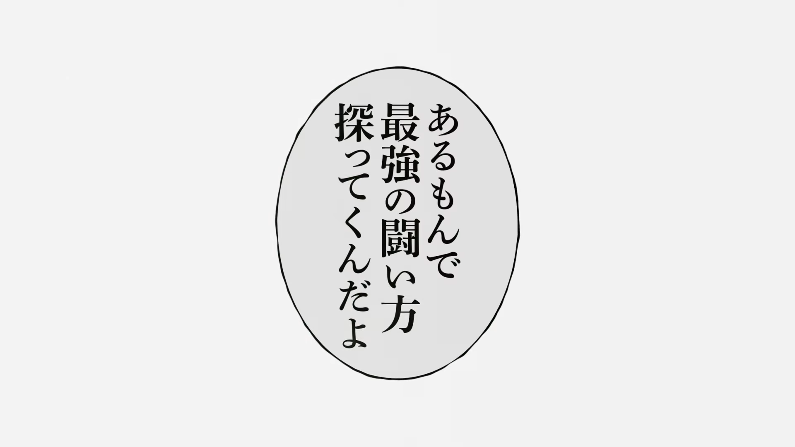

- 静止画は切り貼りと違って大量の試行錯誤を回すことができない
    - 1カット作るだけで数時間〜数日かかるため
- Vコン時点でイメージしてたものと完成形があまりに違いすぎるとだいぶ面倒くさい（まぁいつも大体そうだけど……）
- Vコンと完成形のギャップを埋めることで先の見通しが立つようにし、重い作業に時間を取られることなく試行錯誤を大量に回せるようになりたい
- なんか武井壮が言ってた「身体をイメージ通りに動かす能力」の話を思い出すわね
    - 完成形をイメージ通りに出力する能力
    - これは己を知れば百戦危うからず的な話かも
    - 身の丈に合わない完成形をイメージしない
    - あるもんで最強の闘い方探ってくんだよ定期

