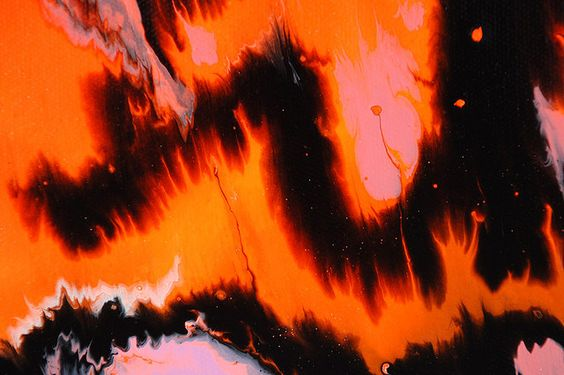
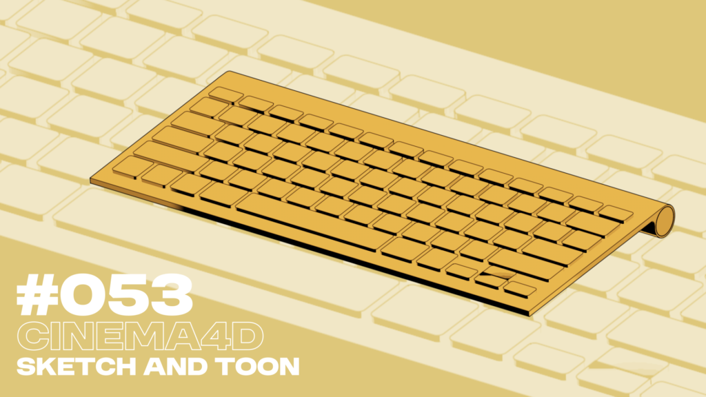
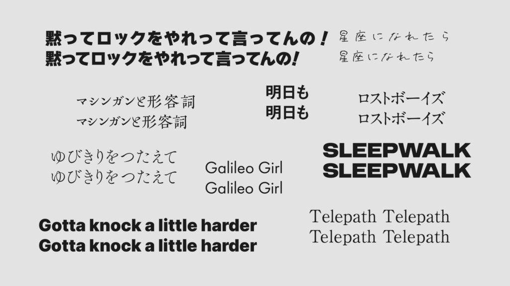
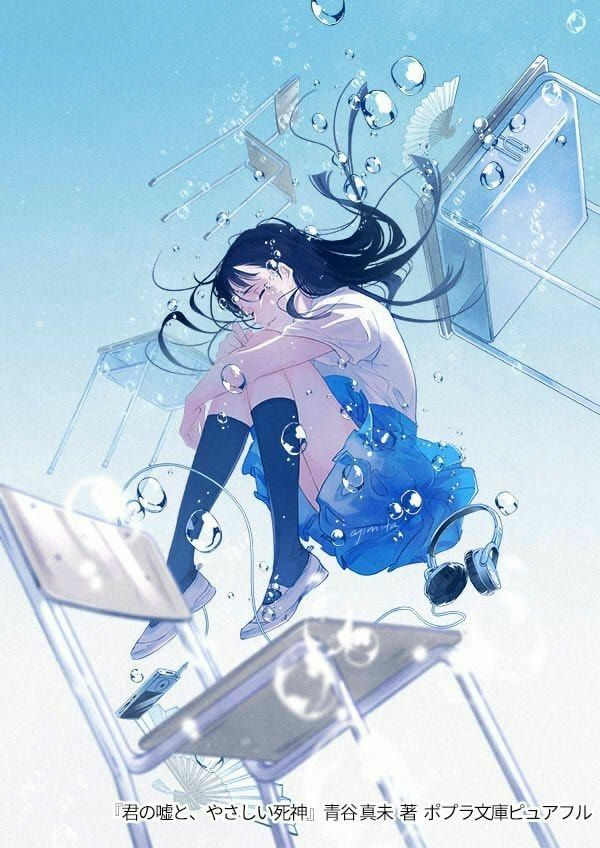
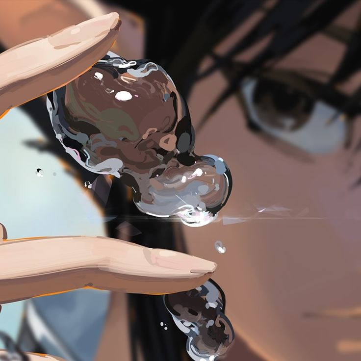

<!--more-->

# #051

課題：こういう質感

## Output

# #052

課題：C4D初心者

## Output

## Review

- エフェクターの挙動が若干理解できた？

- 簡単な動きしかまだ作れない

- C4Dでセルルック、わからん
    - カラーと反射をゼロにして発光を2にしたけど、色の制御が上手くいかない感じ
    
    - アウトラインの付け方もまた今度勉強したい

# #053

課題：C4D初心者 2

## Output

## Review

- アウトラインをつけてレンダリングする方法を覚えた

- 標準レンダラーのSketch and Toonを使う

- 背景透過させるのにちょっと手間取った

# #054

課題：C4D初心者 3

## Output

# #055

課題：C4D初心者 4

## Reference

## Output

# #056

課題：ゲーミング竜巻

## Output

# #057

課題：字詰めノック

## Reference

[https://photoshopvip.net/81781](https://photoshopvip.net/81781)

【英字】

- 問題児に気をつけろ
    - AKVWVPFLT

- 両方丸なら狭く、両方直線なら広く

【小技】

- 上下反転させてただの図形として認識すればカーニングしやすい

## Output

## Review

- フォントや文面によって別に字詰め必要ないものも結構あった

- 派手にひどいとき以外別にやらなくてよさそう

# #058

課題：水泡をC4Dで

## Reference

## Output

# #059

課題：チマチマモーショングラフィックス

## Reference

## Output

# #060

課題：AE上で水滴表現

## Reference

## Output
