<!--more-->

# #061
完成日：2024/12/09（月）

課題：残光表現

## Output
<!-- 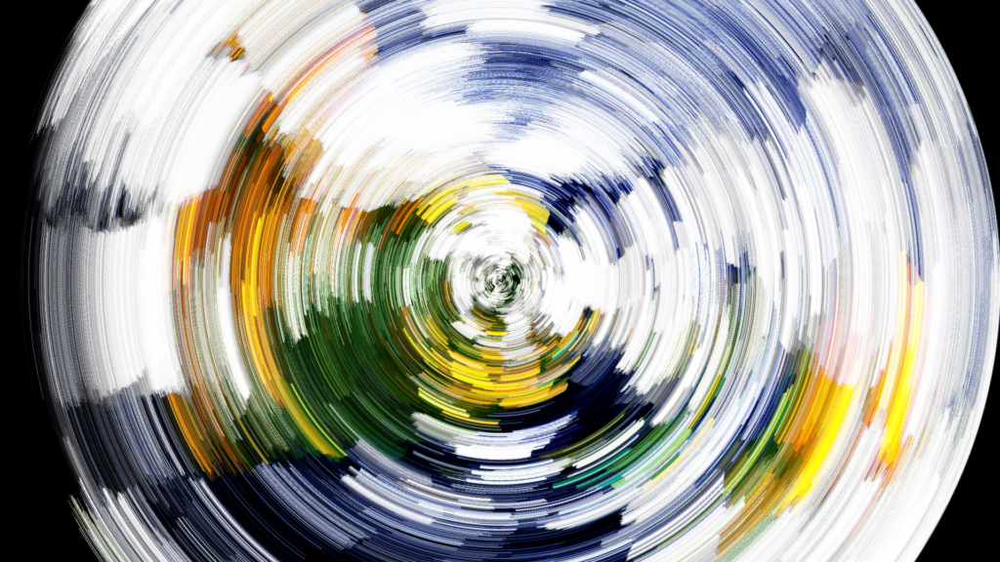

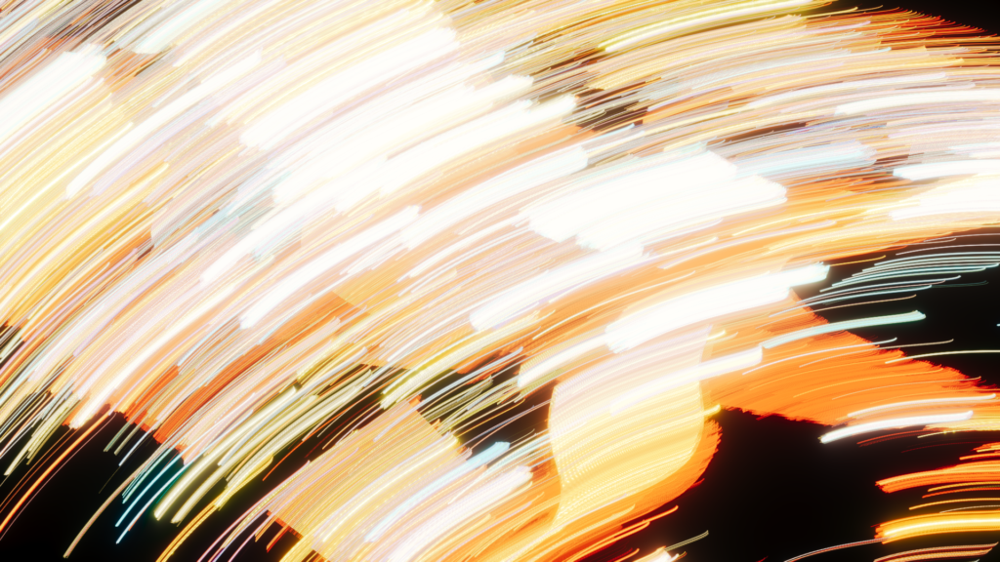

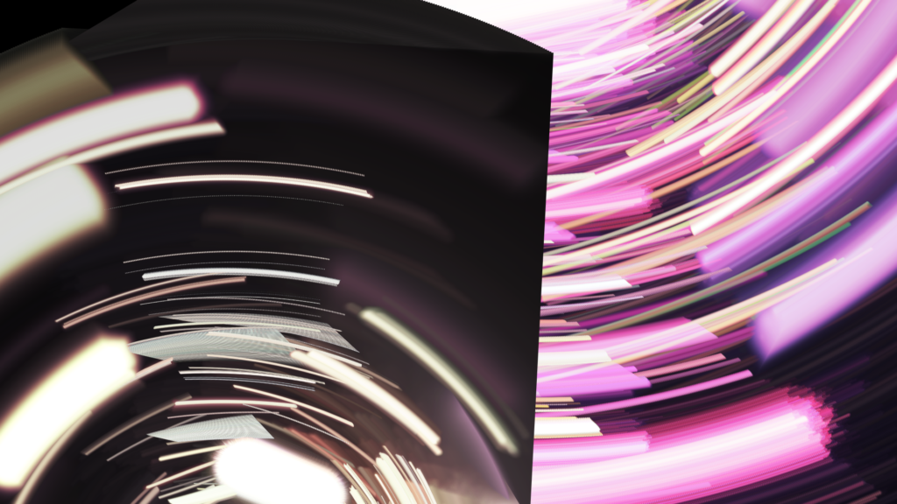 -->

https://x.com/ALINCO2020/status/1865795657895936326

# #062
完成日：2024/12/09（月）

課題：自動検出的な仕組みをAE上で

## Output
https://x.com/ALINCO2020/status/1865805127497736630

# #063
完成日：2024/12/10（火）

課題：プロシージャル紙エッジ

## Output
https://x.com/ALINCO2020/status/1866410335567331525

# #064
完成日：2024/12/25（水）

課題：いろんなテキスト表現

## Reference
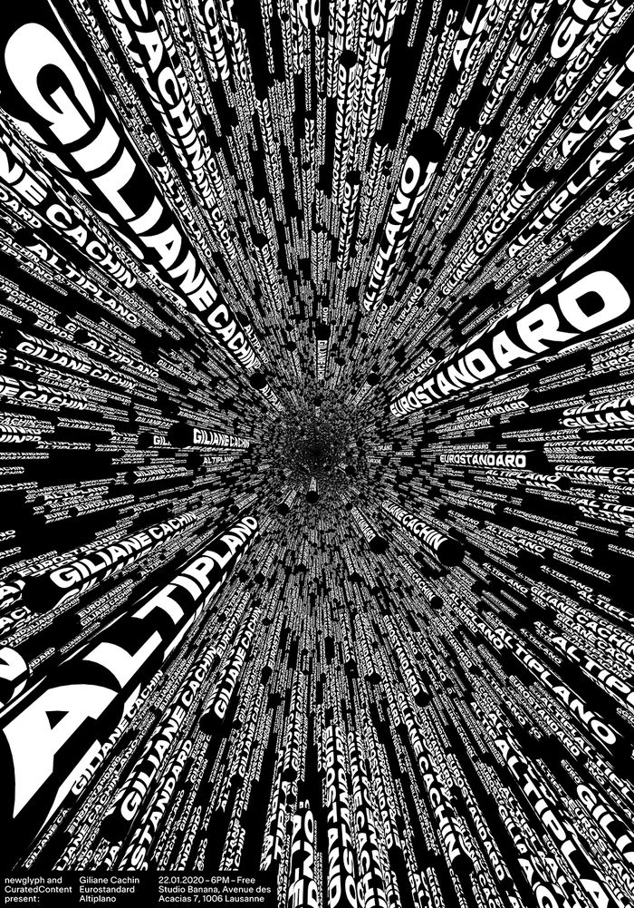

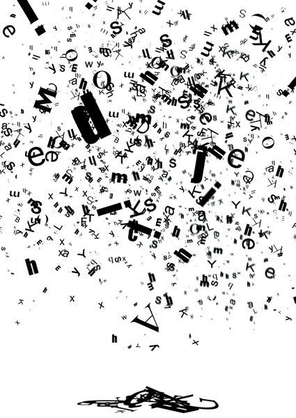

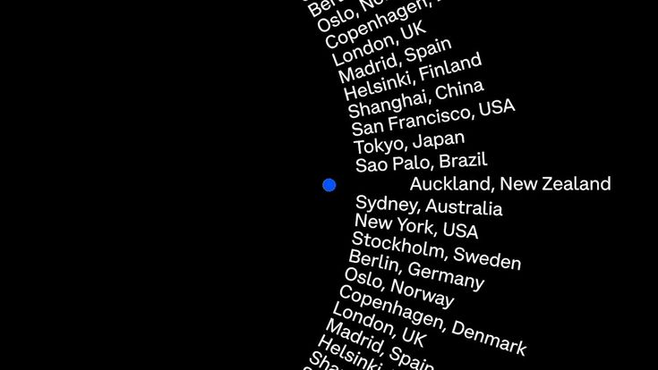

## Output
https://x.com/ALINCO2020/status/1871670530379821440

# #065
完成日：2024/12/25（水）

課題：グラフィカル水

## Reference
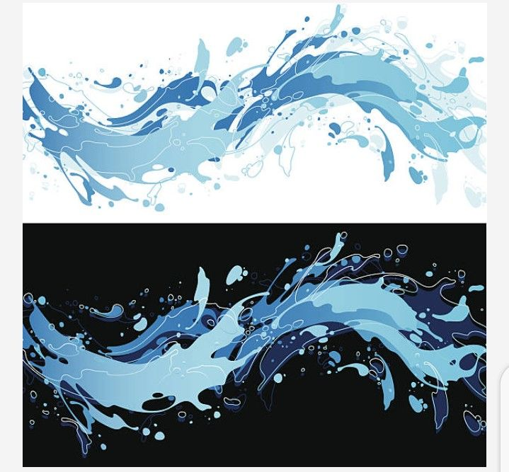

## Output
https://x.com/ALINCO2020/status/1871843829646823826

# #066
完成日：2024/12/25（水）

課題：コースティクスコンポ

## Reference
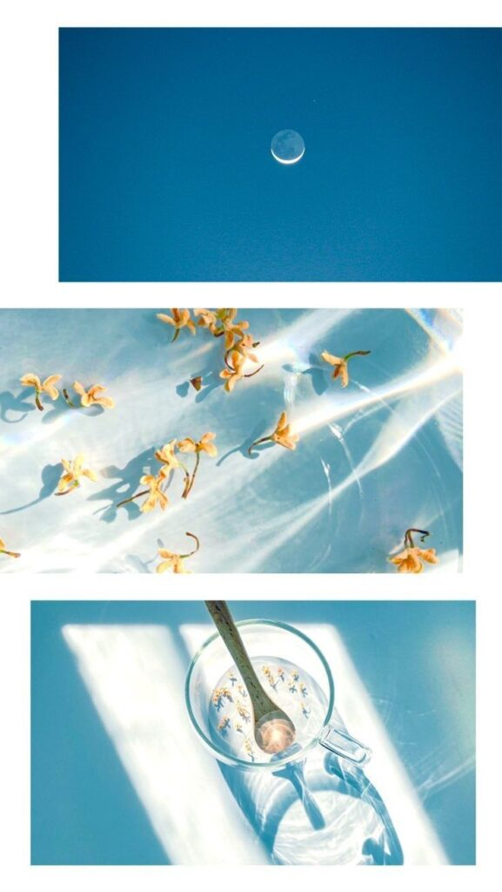

## Output
<!-- 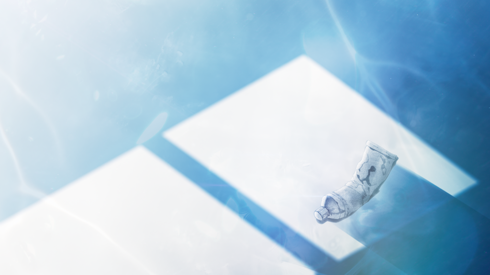 -->

https://x.com/ALINCO2020/status/1871858926163288069

# #067
完成日：2024/12/25（水）

課題：透明感コンポ

## Reference
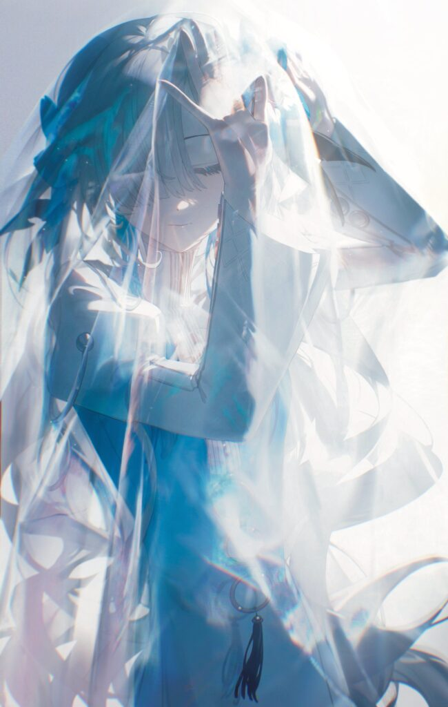

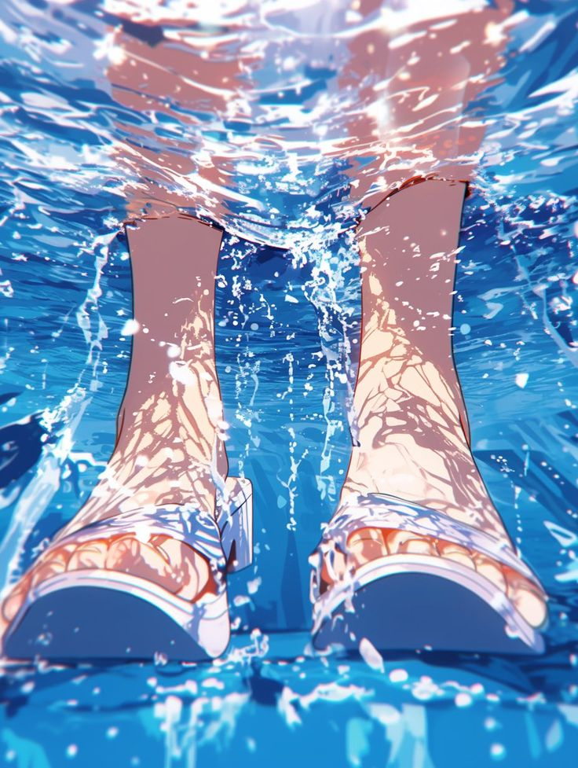

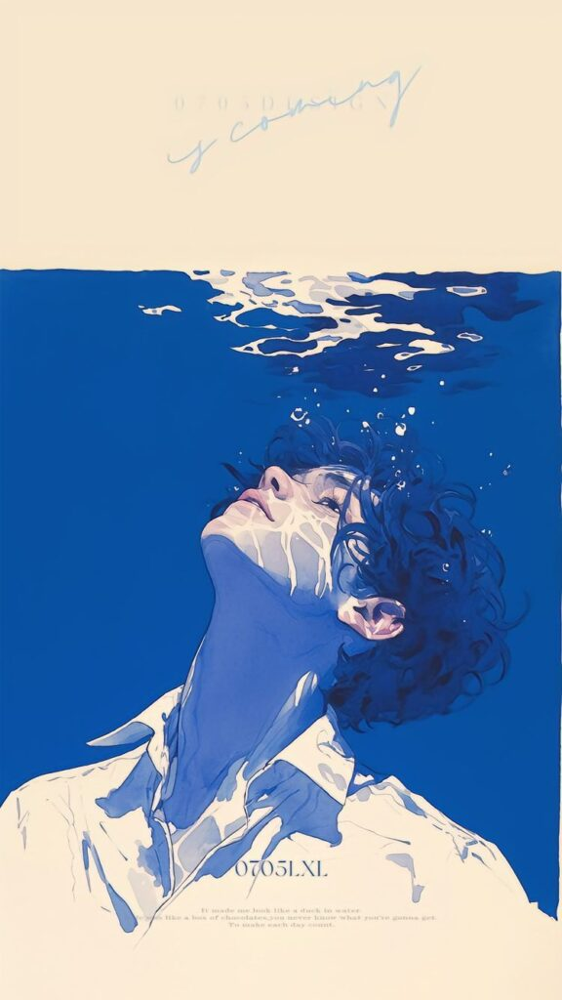

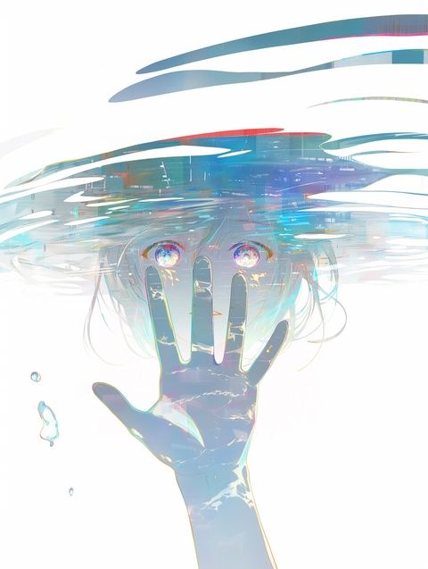

## Output
<!-- 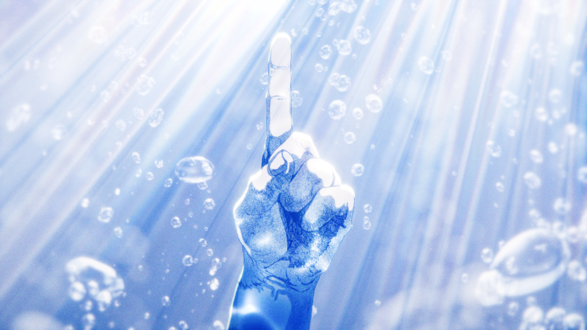 -->

https://x.com/ALINCO2020/status/1873604549967274347

# #068
完成日：2024/12/30（月）

課題：髪の毛逆光コンポ

## Output
https://x.com/ALINCO2020/status/1873760164517687408

# #069
完成日：2024/12/31（火）

課題：3Dコースティクス

## Output
<!-- 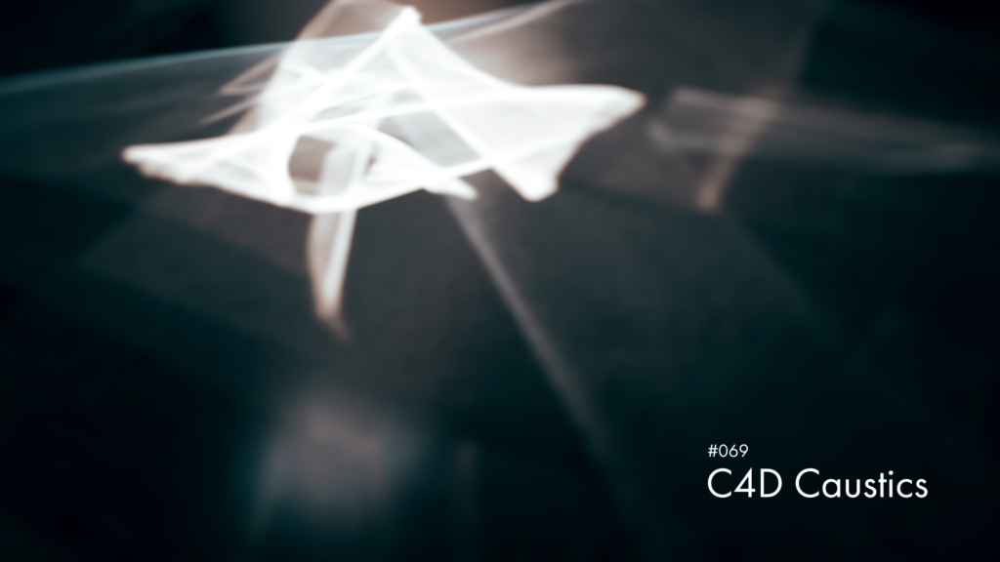 -->

https://x.com/ALINCO2020/status/1873906609908572439

# #070
完成日：2024/12/31（火）

課題：水面キラキラ

## Reference

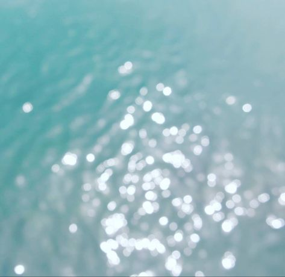

## Output
https://x.com/ALINCO2020/status/1874526319465406623