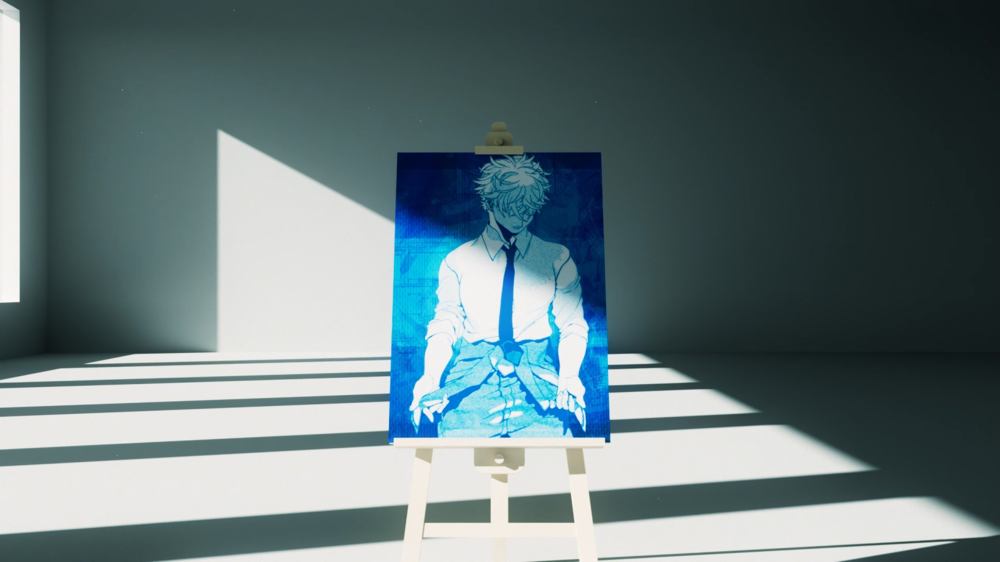
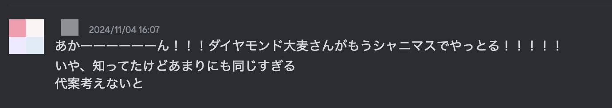
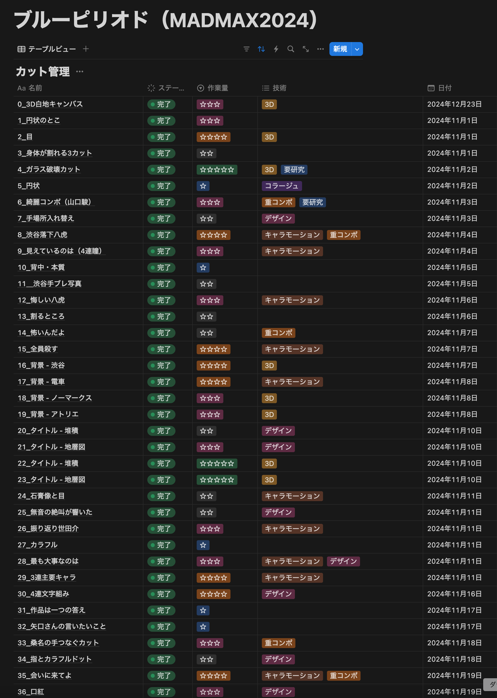
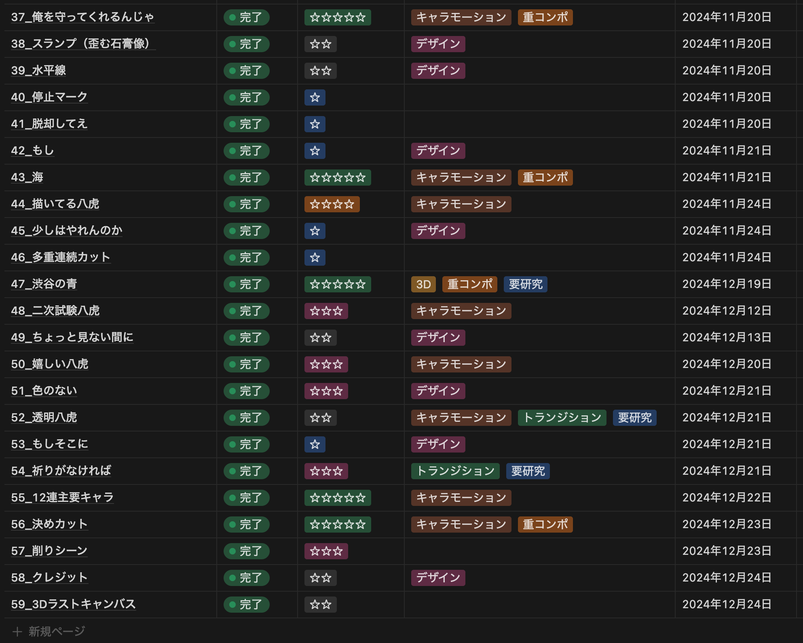
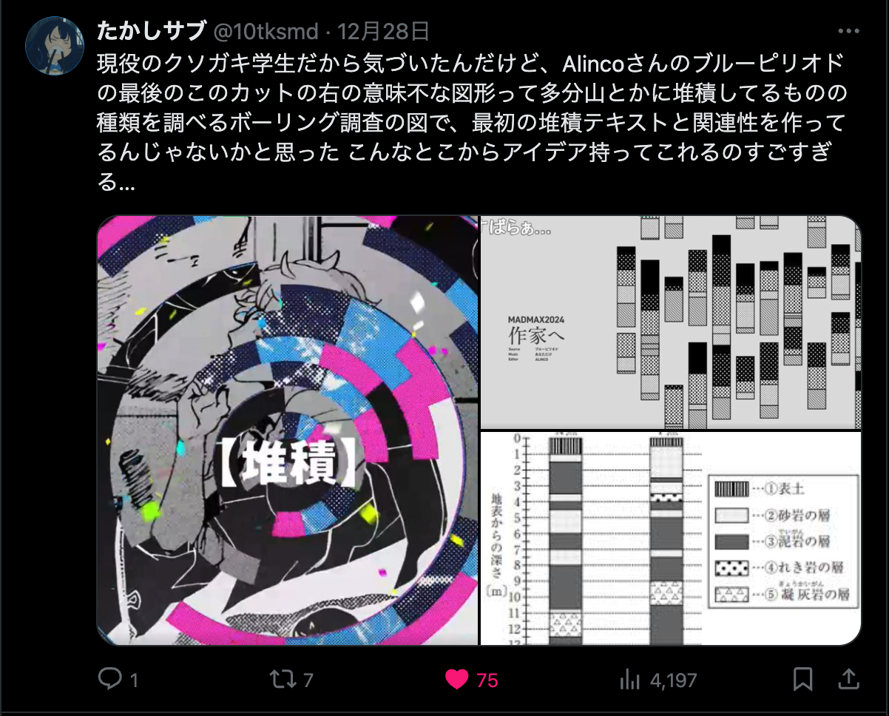

MADMAX2024に参加しました。くろべさんと対戦しました。ありがとうございました。

[【MAD】 作家へ 【ブルーピリオド】](https://www.nicovideo.jp/watch/sm44470920)



今回の動画はそこそこ伝わるように作れた感触があるのですが、一応企画・コンセプトの解説的な記事を書いて残しておこうと思います。

<!--more-->

# MADMAXという舞台にふさわしいソースと曲 is 何

相手がくろべさんだったので、対くろべさんの動画を作る必要がありました。系統で言うと『9番目の「？」』系のほうが正統派のくろべさんとの票割れを狙えるかも……みたいなことをぼんやり考えてました。

ソース候補は

- ブルーピリオド
- ヒロアカ
- 血界戦線
- ハイキュー

辺りがありました。選曲はとっておきのやつばかりなので秘密。

くろべさん相手にハイキューで勝てたら気持ちええやろなぁ……という性格の悪い発想などもありつつ、最終的に選ばれたのはブルーピリオドでした。好きだし。

曲はなんでこれにしたんだっけな………。単純に火力が高かったからかも。あと好きだし。

# 初期モチーフはダイヤモンド

くろべさんに勝つには「高い圧の画面+ある程度納得感のある構成」が必要でした。構成面ではどうあがいても勝てないので、画面盛る方向がメインではありつつ、構成もある程度頑張らないとな〜とは考えてました。

ブルーピリオド×あなただけ で行くなら選ぶエピソードは受験編。

初期の企画・コンセプトは

```
透明だった八虎があらゆる経験を通じて作家になる

ダイヤの原石が地圧によってダイヤモンドに変質する
```

でした。Vコン作った段階ではまだダイヤモンドで行こうとしてました。↓

https://youtu.be/jYEYi3T4jwE?si=aQNCiMHmBW73qLxm

所々違うけどほとんど同じですね……。ここまでVコン詰めれたのは初めてかもです。でも作り進めていくうちに



となり、ダイヤモンドは却下して地圧による変質の部分だけ残しました。あれ、ダイヤの原石って地圧でダイヤモンドになるのか？（無知）（適当）（ガバガバ）

（ここだけの話大麦さんの感想ツイートで絶頂してました本当にありがとうございます）

（あとBlueskyでぴさんの感想も貰えてガチで絶叫しました）

# 地層＝レイヤー＝経験（人）

記事タイトルに据えた「人間が人間を形作る」をいい感じに語ろうかと思ったんですけど、カス語彙力で文章がまとまらないので割愛。仰々しいタイトル付けやがって。

要するに「八虎が出会ってきた人たちとそれにまつわる経験が八虎を作家へと変えた」みたいな、そういうことです。

# Notionで進捗管理

これ意味あったのかなぁ……。まぁ一応間に合わせることが出来たからいいか。

Twitterにも貼ってたやつのモザイク無しバージョンです。一応貼っておきます。





あと最後に、わざわざクレジットにも入れたボーリングのグラフィック、ちゃんとわかってくれてる人がいて泣きました。



[https://x.com/10tksmd/status/1872663280290054386](https://x.com/10tksmd/status/1872663280290054386)

語ること語ったのでおまけでトップガンで千代田さんのMAD見て弱気になってるアリ貼っときます。fromアリのMADMAX対策本部


追記：ほんとに負けました
