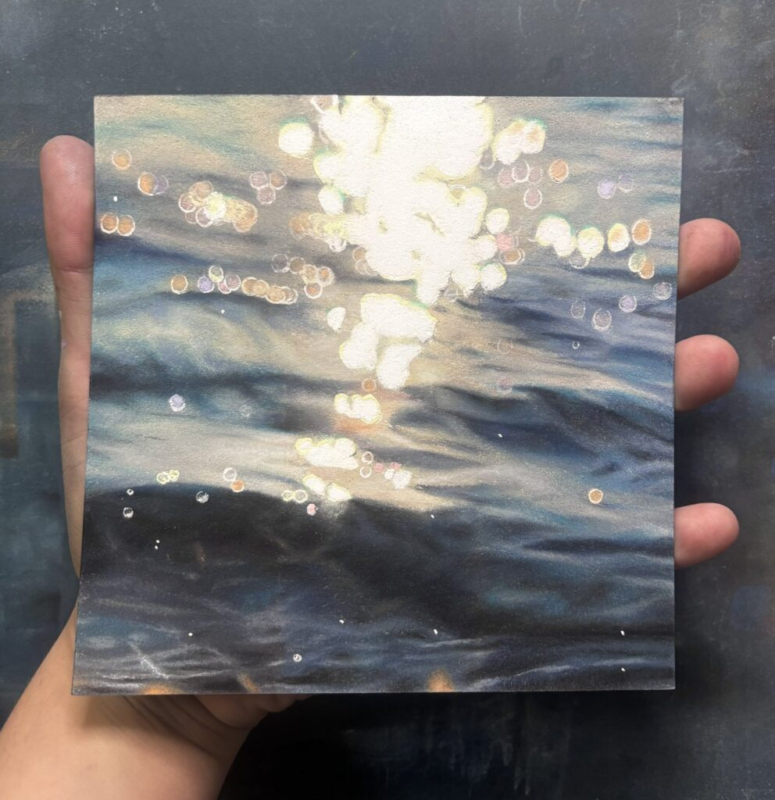
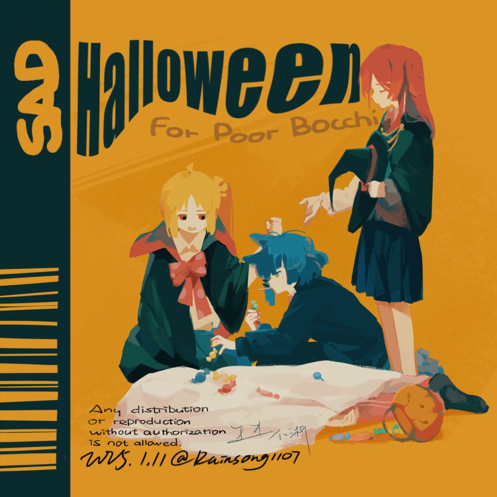

<!--more-->

# #071

課題：爽やかコンポ

## Output

# #072

課題：情報量多め背景で何層まで行けるか

## Output

https://twitter.com/ALINCO2020/status/1875171652398657748

# #073

課題：AEパズル「レイヤー別bfx map ramp」

## Output

# #074

課題：背景と同化するイラスト

## Output

https://twitter.com/ALINCO2020/status/1879378303834066978

# #075

課題：TAMABOKE

## Reference

## Output

https://twitter.com/ALINCO2020/status/1880485167812472856

# #076

課題：グニャグニャ五線譜

## Output

https://twitter.com/ALINCO2020/status/1880926508442849329

# #077

課題：フラットな質感

## Reference

## Output

https://twitter.com/ALINCO2020/status/1881590227011293444
