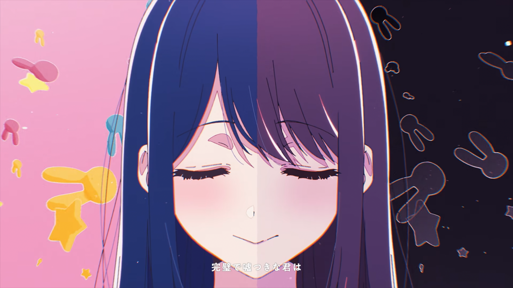

映像作品からの引用に限定する。

<!--more-->

# 鏡面反射

ref: BORUTO ED「またね」

鏡面の向こうにキャラの別の側面が映るアレ。シンプル鏡や水たまり、金属面、ウユニ塩湖など、反射するならなんでもいい。

反射面へのキャラの向き合い方でその側面に対する感情や現時点での状態も表現できるか。

# 画面構成・構図

ref: [きらめく絆創膏 / 名取さな (official)](https://youtu.be/rcG1sZILjfc?si=xCzW0DIS_x9HqoV1)

ref: [TVアニメ『かぐや様は告らせたい～天才たちの恋愛頭脳戦～』オープニング映像 ♪鈴木雅之「ラブ・ドラマティック feat. 伊原六花」](https://youtu.be/6vRxlXHH4H8?si=FXczG3M8-1X7xZ9f)

ref: [フォニイ / 25時、ナイトコードで。 × MEIKO](https://youtu.be/zBePOfn5FIg?si=RDN1xsGv3dwQbEQe)

ref: [メズマライザー / 初音ミク・重音テトSV](https://youtu.be/19y8YTbvri8?si=sXS_VJ_1uPkk1eBb)

画面を左右や上下に分けるのが一番わかりやすい気はしてる。

# 色に差をつける

ref: BORUTO ED「またね」

↑キャラの向きで対立してる感が伝わる。

ref: [【AMV/MAD】きみが死ぬまで恋をしたい【シュプレヒコール】](https://youtu.be/NVcVxddOzPs?si=HAQi4V9TOEKn9PFv)

↑混ぜたりも出来る。

# 明暗に差をつける

ref: [YOASOBI「アイドル」 Official Music Video](https://youtu.be/ZRtdQ81jPUQ?si=Cacv1ei-Xt5KyEIj)

闇落ち感。

# 少し要素を変えて時間差で同じ画面を繰り返す
これが一番気持ちいい。

ref: [【AMV/MAD】忘却バッテリー【会心の一撃】](https://youtu.be/yKQ_4zQMUAE?si=DIKr0IiZq0rC3UzN)

ref: 僕だけがいない街 OP

# 線画と塗りがズレる（別の動きをする）
未確定、不安定な印象。

ref: [TVアニメ『天国大魔境』ノンクレジットオープニング映像 ｜BiSH「innocent arrogance」](https://youtu.be/GuAcdIqcanA?si=U94GL7vjSLpr0_oN)

ref: [【MAD】 「I」 【やがて君になる】](https://www.nicovideo.jp/watch/sm41566164)

# モチーフで表現

ref: [初星学園 「Luna say maybe」Official Music Video (HATSUBOSHI GAKUEN - Luna say maybe)](https://youtu.be/Sq5Dj0U06vQ?si=2gD0xQfLvTFj8fwb)
- オセロ
- 丸とバツ

# 同じ下地に別のテキストを乗せる

ref: [【MAD】 どうか、届きますように 【ミューズの真髄】](https://youtu.be/RUzFpL5lLc0?si=3pWnuxIDsQrMcX_f)

↑文字情報の対比。動画見たらわかるけど、出し方もリフレインでめっちゃ対比でうわ〜〜〜ってなります。

ref: [花澤香菜「Love Me」Music Video](https://youtu.be/4aEyCk8IbRc?si=m4Bq7yDmwUupEqnl)

↑台本これめっちゃ良いモチーフだよな〜。登場人物的なこと出来るし、時間経過的なことも出来るし。

# コンポの質感に差をつける

ref: [【MAD】 Sleep tight, sweetheart 【まちカドまぞく】](https://www.nicovideo.jp/watch/sm43180850)

↑セルルックとフォトリアル。

ref: [いらないもの / キタニタツヤ✕なとり - Chained / Tatsuya Kitani × natori](https://youtu.be/iO4YnxDHnig?si=2ZVTXX0XgVQ5eQii)

↑アニメと実写。  
これは多分「キタニタツヤ✕なとり」だから採用された表現であって、別に対比構造とかではないかもだけど、質感に差をつけるリファレンスとして一応。