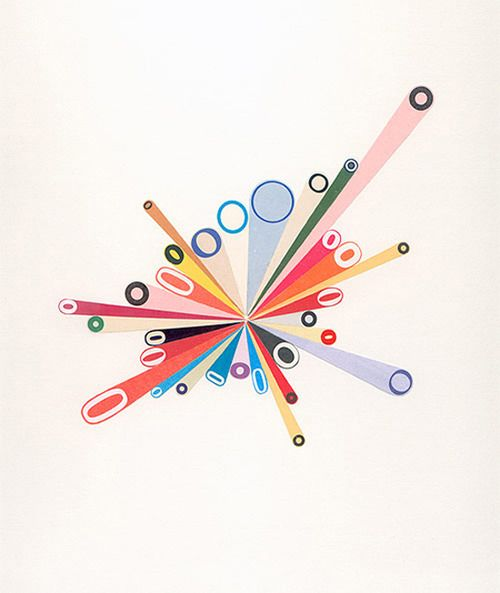
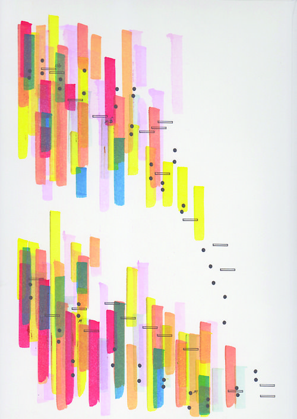

<!--more-->

# \#081
完成日：2025/02/02（日）

課題：シェイプ展開

## Reference

{.flex2}

## Output
[https://x.com/ALINCO2020/status/1886057573557875115](https://x.com/ALINCO2020/status/1886057573557875115)

# \#082
完成日：2025/02/06（木）

課題：キューブモーション

## Reference

{.flex2}

## Output
[https://x.com/ALINCO2020/status/1887157365239365665](https://x.com/ALINCO2020/status/1887157365239365665)

# \#083
完成日：2025/02/23（日）

課題：かっこいい系のグラフィック素材作り

## Output
[https://x.com/ALINCO2020/status/1893588758777168016](https://x.com/ALINCO2020/status/1893588758777168016)

# \#084
完成日：2025/02/24（月）

課題：背景グラフィック作り in AE

## Output
<!--  -->

https://x.com/ALINCO2020/status/1893965401043705864

# \#085
完成日：2025/02/27（木）

課題：アルバムジャケットデザインノック

## 曲
ブラッドサーキュレーター - ASIAN KUNG-FU GENERATION

生活の果てに音楽が鳴る - amazarashi

笑って - プッシュプルポット

片目のウィリー  - THE PINBALLS

風、花、ノイズ、街 - 日食なつこ

少年少女 - 銀杏BOYZ

ビビデバ - 星街すいせい

絶対零度 - なとり

## Output
<!-- 

{.flex2} -->

https://x.com/ALINCO2020/status/1894965550805381161

## Review
- 素人感エグい
- いや素人なんですけども

# \#086
完成日：2025/03/23（日）

課題：チマチマグラフィックノック

## Output
<!-- 

{.flex2} -->

https://x.com/ALINCO2020/status/1903780445885730862

# \#087
完成日：2025/03/24（月）

課題：3Dの動画をAEで3Dっぽくない質感に

## Output
[https://x.com/ALINCO2020/status/1903944771179335952](https://x.com/ALINCO2020/status/1903944771179335952)

# \#088
完成日：2025/04/05（土）

課題：なんか1シーンだけのコンポにクッソ時間かける的な

## Output
[https://x.com/ALINCO2020/status/1908405435842863293](https://x.com/ALINCO2020/status/1908405435842863293)

# \#089
完成日：2025/04/09（水）

課題：ここはなんか情報量多めな賑やかな感じでお願いします！

## Output
[https://x.com/ALINCO2020/status/1909969216763211871](https://x.com/ALINCO2020/status/1909969216763211871)

# \#090
完成日：2025/04/13（日）

課題：Stardustでパスに沿うやつってどうやるんだっけ

## Output
[https://x.com/ALINCO2020/status/1911086354332786769](https://x.com/ALINCO2020/status/1911086354332786769)

## How to
- イラレで任意のパスを用意
- ライトレイヤー追加
- イラレのパスを選択した状態でコピー
- ライトレイヤーの位置を選択した状態でペースト
- StardustでLightを選択