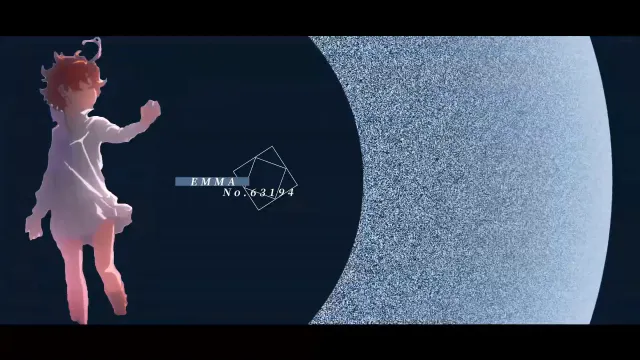
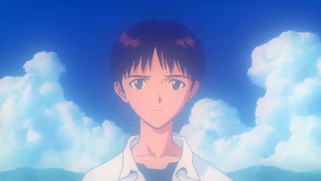
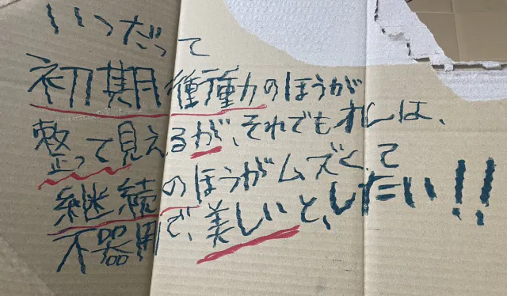

明日の作業が多くて、寝るのが嫌で、自分の昔のMADを見返してた。

昔の自分の動画、今見るとヘタクソだけど"飢え"が感じられてよかった。初期衝動って感じがした。

<!--more-->

[【MAD】children.execute(escape);【約束のネバーランド】](https://youtu.be/LDRsr9RbVyQ?si=9jikVFMgJJgUZM0C)

この辺とか

[【MAD】うるさい【エヴァンゲリオン】](https://youtu.be/qEP7-NBP8YE?si=qzQdW0AmFpkeNiqJ)

この辺とか。両方限定公開だから知らない人多そう。

今はもっと良くする方法が思い浮かぶけど、当時は思いつけなかった。でもわからないなりに頑張ってたと思う。がむしゃらさとか、ひたむきさとか、必死さとかがあった。

もう今年で初めてAniPAFEに出てから5年経つのか……。もはや今となっては脳汁ドリブン制作はできないし、MAD作ってても前ほどワクワクしなくなったし、残り火みたいな情熱を頑張って絶やさないようにしてる感覚がある。

あの頃の自分に負けたくない。もっと飢えろ〜〜。現状に満足するな〜〜〜。

↑どこで拾った画像か忘れたけど今これ